# Network Devices
## Hosts
- device that sends or receives traffic
- Two types: Client and server
- Client initiate requests
- Server responds
## IP Address
- Identity of a host
- ipv4 address - 32 bits - 4 octets - 4 decimal numbers
- each octet range: 0 - 255
- Subnetting: process of breaking up of ip addresses into different hierarchy
## Network
- this is what transports traffic between hosts
- logical grouping of hosts needing similar connectivity
- can contain other networks - subnets
- network connect to other networks via Internet
## Repeater
- simply <b>regenerates</b> signals
- useful in case of long distance communication
- but doesn't scale to multiple hosts connecting to multiple hosts...becomes a mess
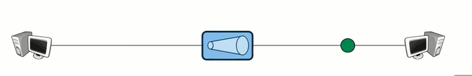
## Hub
- simple </b>multi-port repeaters</b>
- scales well for multiple hosts
- drawback - all other nodes receive what one node is sending to another node
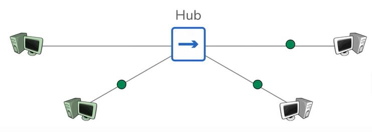
## Bridge
- <b>sits between hub connected</b> hosts
- only have 2 ports
- Main pro - learns which hosts are on which side
- will only bleed traffic to other side if communicating hosts are from opposite sides
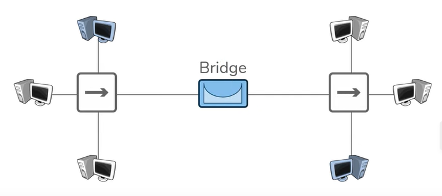
## Switch
- does <b>switching</b> (moving data within network)
- facilitates comm. <b>within</b> a network
- combination of hub and bridge
- like hub becoz it has multiple ports
- like bridge becox it learns which host is on each port
- host to host comm. happens smoothly within a network
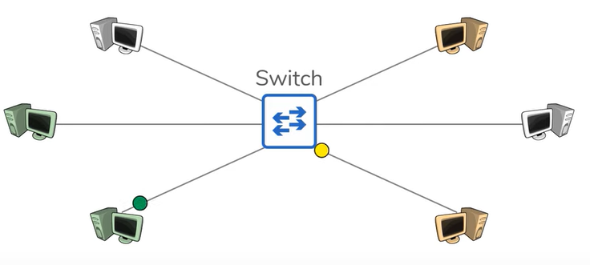
## Router
- does <b>routing</b> (moving data between networks)
- facilitate comm. <b>between</b> networks
- provides a traffic control point (security, policies etc)
- learns which network they are attached to (they have an ip addr in each n/w they are attached to - gateway IP addr)  known as <b>routes</b> and this is stored in a <b>routing table</b>
- <b>gateway</b> - each host's way out of ther local network
- routing table - all the networks a router knows about
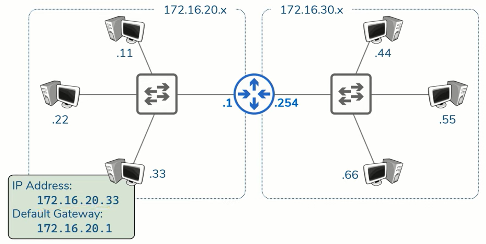
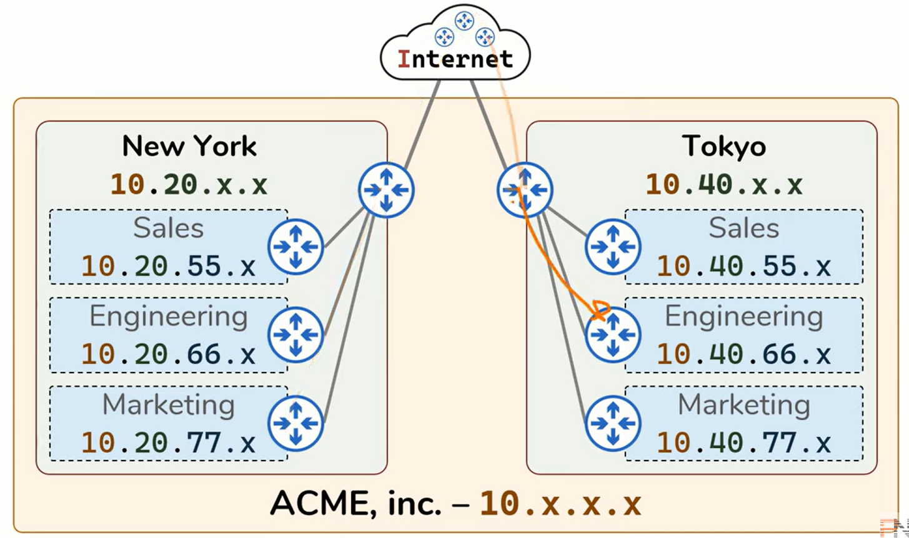

 

# OSI model
- Purpose of networking is to allow two hosts to share data
- There are set of rules to follow while doing that
- The OSI model simply defines the networking rules which are divided into 7 layers
## Layer 1 - Physical - Transporting bits
- Wires, wifi, repeaters, hubs
- Computer data exist as 1s and 0s
- any device that helps with transporting those bits between hosts is layer 1 device
- Example:
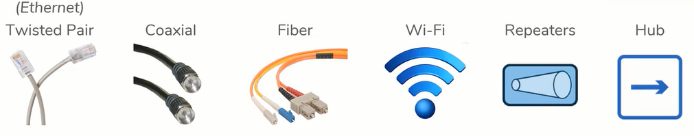
## Layer 2 - Data Link - Hop to Hop
- Switches, NICs
- Interacts with the wire - the device which puts bits on the wire and retreived bits from the wire - example, a NIC card
- Hop to Hop - Layer 2 exists to take bits from one NIC to another NIC. And realistically that can have multiple hops.
- __Addressing scheme__ - MAC addresses - to achieve the hop to hop, MAC addresses are used
- MAC address - 48 bits - 12 hex digits - example: 94-65-9C-12-34-D2
- Every single NIC has a unique MAC addr
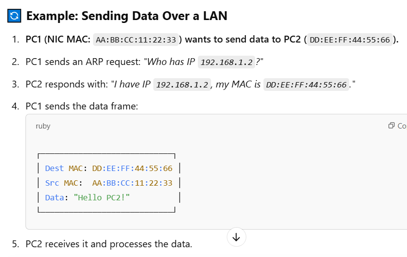
- Switches are also considered as layer 2 devices becoz they help accomplish hop to hop
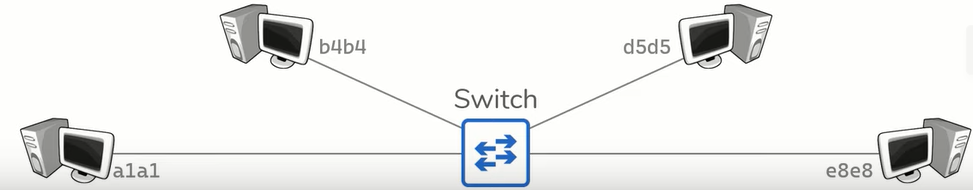
- If layer 2 is taking care of every hop, what is ensuring that data is reaching from src host to dest host - Layer 3
## Layer 3 - Network - End to end
- Routers, hosts (basically anything with an IP addr)
- To accomplish the end-to-end delivery, n/w layer uses IP addresses
- __Addressing scheme__ - IP Address - 32 bits - 4 octets - each can be 0-255
- If we have IP addr at L3, why need MAC address at L2? - becoz they serve different functions. MAC addr for hop to hop and IP addr for end to end.
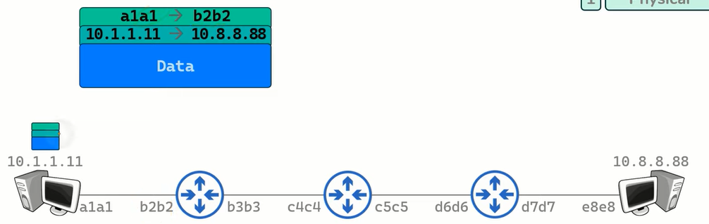
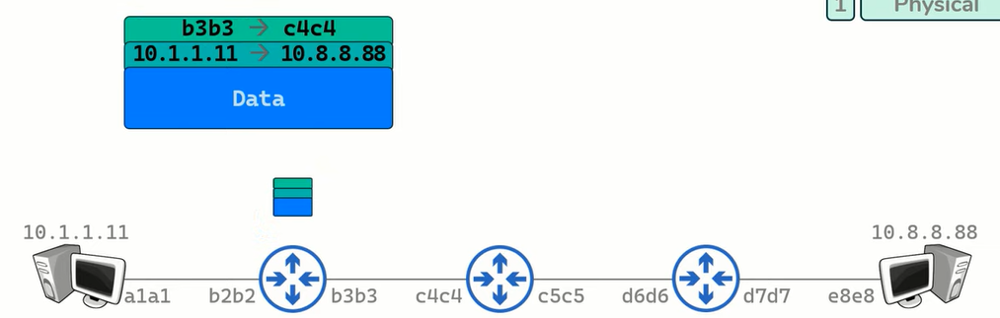
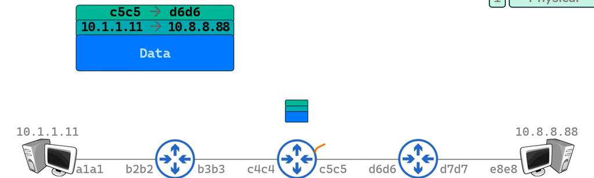
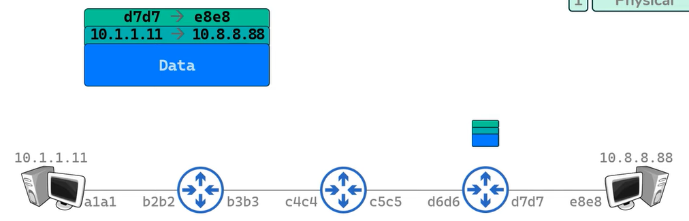
Here in the above pictures, once the packet reaches the router, it removes the L2 header and replaces with new L2 header. Similarly once the packet reaches the dest host, the L3 header is removed and we are left with the actual data. 
<i><u>NOTE</u> - even though IP addr and MAC addr are independent functions, there is a protocol that ties them together - ARP</i>

## Layer 4 - Transport - 

