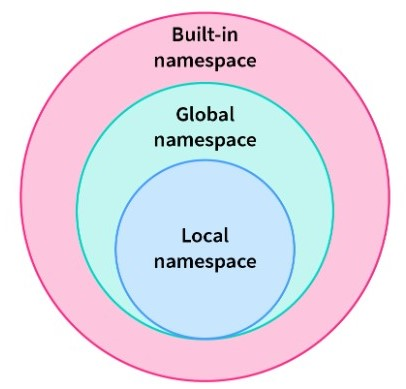
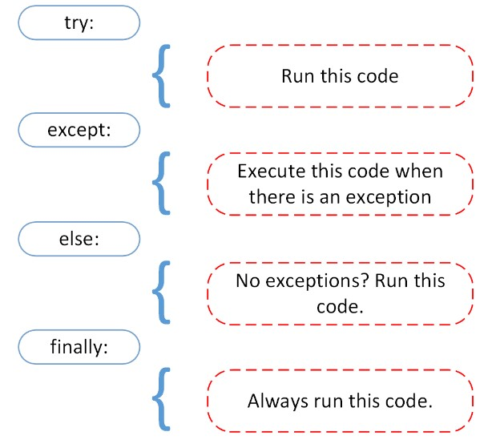

# Python

## Data Types
1) **Numeric** - int, float, complex
2) **String** - str
3) **Sequence** - list, tuple, range
4) **Mapping** - dict
5) **Boolean** - bool
6) **Set** - set, frozenset

## Type Conversion
### Implicit conversion
- happens automatically
- like when `int + float = float`
- no loss of data occurs in this

### Explicit conversion
- happens when we voluntarily change the type of data
- aka **Type Casting**
- exaple : *int(). str(), float()*
- loss of data is possible here

## Operators
- Identity Operators : **is**, **is not**
- Membership Operators : **in**, **not in**

## Namespace
- Namespace is a mapping of every name we have defined to corresponding object
### Types of namespace
1) **Builtin namespace** - namespace containing all builtin names is created when we start Python interpreter and exists as long as interpreter runs. The built-in namespace contains predefined/built-in functions and objects. The scope of built-ins is the same as the lifetime of the entire program. *Eg : dict, enumerate, eval, input, id, list etc*
2) **Global namespace** - each module creates its own global namespace. These different namespaces are isolated. Hence, the same name that may exist in different modules does not collide.
3) **Local namespace** - it is created when a function is called



## Scope
- Although there are various unique namespaces, we may not be able to access all of them from every part of the program. Hence the concept of scope.
- A scope is a portion of the program from where a namespace can be accessed directly without any prefix.

```python
v1 = 10
def outer():
    v2 = 20
    def inner():
        v3 = 30
        print(v3)
    print(v2)
    inner()
print(v1)
outer()

###### OUTPUT
10
20
30
```

```python
# --- global keyword ---
v1 = 10
def fun():
    v2 = 20
    global v1
    v1 = 30
print(v1)
fun()
print(v1)

###### OUTPUT
10
30
```

## Recursion
### Advantages
- code is more clean
- complex task broken down into simpler sub-problems
- sequence generation is easier with recursion than using some nested iterators

### Disadvantages
- sometimes logic behind recursion is hard to follow through
- recursive calls are expensive as they take up a lot of memory and time
- hard to debug

## Anonymous function
- Lambda functions are called anonymous functions
- Syntax : `lambda args: expression`
```python
lis = [1,2,3,4,6,8,11,13,12]

# --- lambda with filter() ---
new_list = list(filter(lambda x: x%2=0, lis))

# --- lambda with filter() ---
new_list = list(map(lambda x: x*2, lis))

# --- parameter less lambda ---
x = lambda : 6
print(x()) # prints 6
```

## Variable Scope
- Based on scope, 3 types of python variables - **local** variables, **global** variables, **nonlocal** variables
### Local variables
- inside function variables
- cannot access them outside the function
```python
def greet():
    msg = "hi"
    print(msg)
greet()
print(msg) # ERROR

##### OUTPUT
hi
Traceback (most recent call last):
  File "<string>", line 5, in <module>
ERROR!
NameError: name 'msg' is not defined
```

### Global variables
- variables declared outside function or in global space
- can be accessed inside or outside function
```python
msg = "hi"
def greet():
    print(msg)
greet()
print(msg)

###### OUTPUT
hi
hi
```

```python
def outer():
    n = 20
    def inner():
        global n
        n = 25
    print(n) # --> 20
    inner()
    print(n) # --> 20
outer()
print(n) # --> 25
```
- if we make any changes inside `inner()` function, the changes appear outside the local scope i.e. `outer()` function

### Nonlocal variables
- used in nested functions whose local scope is not defined
- means that variable can neither be local nor be global
- we use `nonlocal` keyword to create variable
```python
def outer():
    msg = "local"
    def inner():
        nonlocal msg
        msg = "nonlocal"
        print(msg)
    inner()
    print(msg)
outer()

##### OUTPUT
nonlocal
nonlocal
```
- If we change the value of nonlocal variable, the changes appear in local variable

## Exception Handling


## Iterators
- They are methods that iterate collections like lists, tuples etc.
- A python iterator object must implement two special methods `__iter__()` and `__next__()`, aka iterator protocol.

```python
lis = [1,2,3,4]
iterator = iter(lis)
print(next(iterator))
print(next(iterator))
print(next(iterator))
print(next(iterator))
print(next(iterator)) # Error

##### OUTPUT
1
2
3
4
Traceback (most recent call last):
  File "<string>", line 7, in <module>
StopIteration
```

### Custom iterators
- `iter()` returns the iterator object itself. Some other initialization can also be done.
- `next()` must return the next item in sequence. On reaching the end, it must raise **StopIteration** exception.

```python
class PowTwo:
    def __init__(self, max=0):
        self.max = max
    
    def __iter__(self):
        self.n = 0
        return self

    def __next__(self):
        if self.n <= self.max:
            result = 2 ** self.n
            self.n += 1
            return result
        else:
            raise StopIteration

nums = PowTwo(3)
i = iter(nums)
print(next(i))
print(next(i))
print(next(i))
print(next(i))
print(next(i))

###### OUTPUT
1
2
4
8
Traceback (most recent call last):
  File "<string>", line 23, in <module>
  File "<string>", line 15, in __next__
StopIteration
```

### Infinite iterators
```python
from itertools import count

i = count(1)
print(next(i))
print(next(i))

##### OUTPUT
1
2
```

## Generators
- generator is a function that returns an iterator that produces a sequence of values when iterated over
- useful when we want to produce a large sequence of values but we don't want to store in memory
- here we use `yield` keyword instead of `return`

```python
def gen(n):
    val = 0
    while val < n:
        yield val
        val += 1

for val in gen(3):
    print(val)

##### OUTPUT
0
1
2
```
- `yield` keyword is used to produce a value from the generator and pause the generator function's execution until next value is requested.
```python
g = gen(3)
print(next(g))
print(next(g))
print(next(g))
print(next(g))

##### OUTPUT
0
1
2
Traceback (most recent call last):
  File "<string>", line 11, in <module>
StopIteration
```
### Generator expression
- Syntax : `(expression for item in iterable)`
```python
# ---- generator expression ---
g = (i*i for i in range(5))
```

### Advantages
- Easy to implement
```python
def PowTwo(max=0):
    n = 0
    while n < max:
        yield 2 ** n
        n += 1
```
- Memory efficient
- Represent infinite stream -Excellent choice since generators produce only one item at a time
- Pipelining generators - Multiple generators can be used to pipeline a series of operations. Lets look at an example to find out the sum of squares of numbers in fibonacci series.
```python
def fibo(nums):
    x, y = 0, 1
    for _ in range(nums):
        x, y = y, x+y
        yield x

def square(nums):
    for num in nums:
        yield num ** 2

print(sum(square(fibo(10))))

##### OUTPUT
4895
```

## Closure
- closure is a nested function that allows us to access variables of the outer function even afer the outer function is closed
- In below example, `greet()` function is returning an anonymous function which is assigned to `msg` variable. At this point `greet()` execution is done and `name` variable is destroyed. But when we call the anonymous function, we are able to access `name` variable
```python
def greet():
    name = "John"
    return lambda : "Hi " + name
msg = greet()
print(msg())

##### OUTPUT
Hi John
```

```python
# --- print odd numbers using closure ---
def calculate():
    n = 1
    def inner():
        nonlocal n
        n += 2
        return n
    return inner
odd = calculate()
print(odd())
print(odd())
print(odd())
odd1 = calculate()
print(odd1())
print(odd1())

###### OUTPUT
3
5
7
3
5
```
- closure can be used to avoid global values and provide datya hiding

## Decorators
- Decorator is a design pattern that allows you to modify the functionality of a function by wrapping it in another function
- The outer function is called decorator, which takes the original functionas an argument and returns a modified version of it

```python
# ---- exaple 1 ----
def make_pretty(func):
    def inner():
        print("Hello")
        func()
    return inner

def ordinary():
    print("Ordinary")
    
f = make_pretty(ordinary)
f()

###### OUTPUT
Hello
Ordinary
```

```python
# ---- example 2 (@ symbol) ----
def make_pretty(func):
    def inner():
        print("Hello")
        func()
    return inner

@make_pretty
def ordinary():
    print("Ordinary")
    
ordinary()

###### OUTPUT
Hello
Ordinary
```

```python
# ---- example 3 (function with values or arguments) ----
def smart_divide(func):
    def inner(a, b):
        if b == 0:
            print("Whoops!!")
            return
        return func(a,b)
    return inner

@smart_divide
def divide(a, b):
    print(a/b)

divide(2,5)
divide(2,0)

###### OUTPUT
0.4
Whoops!!
```

```python
# ---- example 4 (chaining of decorators) ----
def star(func):
    def inner(*args, **kwargs):
        print("*****")
        func(*args, **kwargs)
        print("*****")
    return inner
    
def percent(func):
    def inner(*args, **kwargs):
        print("%%%%%")
        func(*args, **kwargs)
        print("%%%%%")
    return inner
    
@star
@percent
def printer(msg):
    print(msg)
    
# above few lines are same as star(percent(printer))

printer("Hello")

###### OUTPUT
*****
%%%%%
Hello
%%%%%
*****
```

## Memory management & Garbage collection
- A Python object is stored in memory with names and references
- Name is just a label. One object can have many names.
- Reference is a pointer to an object.
- Object has 3 things : type, value, reference count (no. of names pointing that object)

### Garbage collection
- Garbage collection is to release memory when object is in no longer use
- This system destroys the unused object
- Python has automated garbage collection. It has an algorithm to deallocate objects which are no longer needed.
- Two ways to delete unused objects: Reference counting and generational garbage collection

#### Reference Counting:
- The reference are always counted and stored in memory
```
a = 50
b = a
c = 50

even though 3 variables are there, they are all pointing to same object => 50 has 3 references
```
- So when references count is 0, the object is deleted from the system by garbage collection
- `del()` does not delete objects, it removes name and reference to the object
- Merit : easy to understand, easy to implement
- Demerit : Doesn't work for cyclic references
```
Example of cyclic reference:
a = []
a.append(a)
This is where "generational garbage collection" method comes into picture
```

#### Generational garbage collection:
- Three lists are created when a program is run ==> Generation 0, Generation 1, Generation 2 lists.
- A new object starts its life in G0.
- If python executes garbage collection process on a generation and an object survives, it moves up to next generation.
- For each generation, garbage collector module has a threshold no. of objects. If the objects count crosses threshold, garbage collection is triggerred.
- *Scanning for cyclic references*: garbage collector uses **reachability analysis** technique. It starts from a set of known root objects and maps to other objects marking each visited object in between as "reachable". If an object is not marked during this analysis, it means no reachanble object is referencing it. Hence its garbage.
```
gc.get_threshold --> (700, 10, 10)
gc.get_count() --> (596, 2, 11) --> no. of objects in each gen currently
gc.collect() --> trigger manual garbage collection
gc.set_threshold(1000, 15, 15)
```