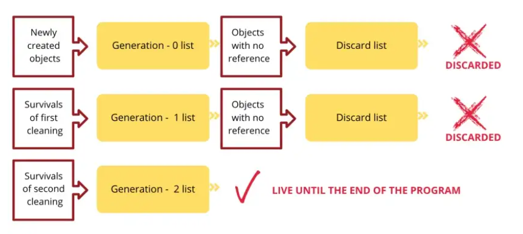

- [Introduction To Python](#introduction-to-python)
  - [Python key features :](#python-key-features-)
  - [Python background :](#python-background-)
  - [Variables :](#variables-)
  - [Garbage collection :](#garbage-collection-)
  - [Data Types :](#data-types-)
    - [Setting the data type :](#setting-the-data-type-)
    - [Setting the specific data type :](#setting-the-specific-data-type-)
  - [Operators :](#operators-)
    - [Arithmetic operators :](#arithmetic-operators-)
    - [Assignment operators :](#assignment-operators-)
    - [Comparison operators :](#comparison-operators-)
    - [Logical operators :](#logical-operators-)
    - [Identity operators :](#identity-operators-)
    - [Membership operators :](#membership-operators-)
    - [Bitwise operators :](#bitwise-operators-)
- [Strings](#strings)
  - [Slicing Strings :](#slicing-strings-)
  - [Python - Modify Strings :](#python---modify-strings-)
  - [String Concatenation :](#string-concatenation-)
  - [Format - Strings](#format---strings)
  - [Escape Characters](#escape-characters)
  - [String Methods](#string-methods)
- [Lists](#lists)
  - [Access List Items](#access-list-items)
  - [Change List Items](#change-list-items)
  - [Add List Items](#add-list-items)
  - [Remove List Items](#remove-list-items)
  - [Loop Lists](#loop-lists)
  - [List Comprehension](#list-comprehension)
  - [Sort Lists](#sort-lists)
  - [Copy Lists](#copy-lists)
  - [Join Lists](#join-lists)
  - [List Methods](#list-methods)
- [Tuples](#tuples)
  - [Access Tuple Items](#access-tuple-items)
  - [Update Tuples](#update-tuples)
  - [Unpack Tuples](#unpack-tuples)
  - [Loop Tuples](#loop-tuples)
  - [Join Tuples](#join-tuples)
  - [Tuple Methods](#tuple-methods)
- [Sets](#sets)
  - [Access Set Items](#access-set-items)
  - [Add Set Items](#add-set-items)
  - [Remove Set Items](#remove-set-items)
  - [Loop Sets](#loop-sets)
  - [Join Sets](#join-sets)
  - [Set Methods](#set-methods)
- [Dictionaries](#dictionaries)
  - [Access Dictionary Items](#access-dictionary-items)
  - [Change Dictionary Items](#change-dictionary-items)
  - [Add Dictionary Items](#add-dictionary-items)
  - [Remove Dictionary Items](#remove-dictionary-items)
  - [Loop Dictionaries](#loop-dictionaries)
  - [Copy Dictionaries](#copy-dictionaries)
  - [Dictionary Methods](#dictionary-methods)
- [Conditional Execution & Loops](#conditional-execution--loops)
- [Comprehensions](#comprehensions)
  - [List Comprehensions:](#list-comprehensions)
  - [Dictionary Comprehensions](#dictionary-comprehensions)
  - [Set Comprehensions](#set-comprehensions)
  - [Generator Comprehensions](#generator-comprehensions)
- [Functions](#functions)
  - [Recursion](#recursion)

---

<br /><br />

# Introduction To Python

## Python key features :
- General purpose language
- Interpreted
- Supports both object oriented and procedure oriented programming
- High level (easy for humans to understand)
- Memory efficient (variables with same value will point to the same memory location instead of having two copies)

--- 

1) `General purpose languge` - Becoz it can be used for machine learning, GUI, web development, software development etc.
   
2) `Interpreted` - Running code line by line => the instruction is executed line by line and not compiling the whole program earlier into machine language. **Python is both compiled and interpreted**. Compilation happens internally i.e. byte code is generated internally and converted to give output using python virtual machine (p.v.m). To prove that, run a .py where another .py file is imported, a pycache folder will be generated which will contain a .pyc file, which is the byte code generated after after compilation of the imported file. So next time when i run the same file, it will not be compiling the imported file
   
3) `Advantages of interpreted language` - Python generates output till the point the code is correct, so **debugging becomes easy**. An interpreter directly translates the code written in a high-level language to machine-level language. Hence, the **size and memory of the program are smaller**. In a compiled language, an executable file is created, which takes up additional space. It is **portable** and need not be recompiled for different platforms. The code can be downloaded as such and used if there is an interpreter in the machine. It is **platform independent** as Python generates byte code before interpretation, this byte code can be used by any other platform to generate output.

4) `Disadvantages of interpreted language` - An **interpreted language is slower** compared to a compiled language. The language analyzes and executes every part of the code, making it process the code every time. An interpreter is needed in the local machine to run the program. An interpreted language is **less secure**. Unlike compiled languages, the interpreter does not have an executable file. So, while sharing the code, we need to share the entire source code

5) `Object oriented programming` - OOP is a computer programming model that organizes software design around data, or **objects**, rather than functions and logic. An object can be defined as a data field that has unique attributes and behavior.

6) `Procedure oriented programming` - This programming language makes use of a **step by step approach** for breaking down a task into a collection of routines (or subroutines) and variables by following a sequence of instructions.

<br /><br />

## Python background :
- Python was first released on **Feb 20, 1991**.
- It was created by **Guido Van Rossum**
- Author of Python was a big fan of British comedy movie called *Monty python's flying circus* and thats where the language got its name.

<br /><br />

## Variables :
- "_" variable refers to the prvious output
- You can get the data type of a variable with the `type()` function.
- Variable names are case-sensitive
- If you want to specify the data type of a variable, this can be done with casting.

> Type `help()` in CLI to get documentation on any topic. Then just type `quit` when you are done. Help function also takes string inputs if u have specific topic in mind, for example, `help('List')`

> To get address of any variable use the `id()` function. Pass the variable name in the curve braces.

<br /><br />

## Garbage collection :
- Garbage collection is implemented in Python in two ways: reference counting and generational. 
- When the reference count of an object reaches 0, reference counting garbage collection algorithm cleans up the object immediately. 
- If you have a cycle, reference count doesn’t reach zero, you wait for the generational garbage collection algorithm to run and clean the object.
  


<br /><br />

## Data Types :
<table border="0">
    <tbody>
        <tr>
            <th>Data Types</th>
            <th>Classes</th>
            <th>Description</th>
		</tr>
        <tr>
            <td>Numeric</td>
			<td>int, float, complex</td>
			<td>holds numeric values</td>
		</tr>
        <tr>
            <td>String</td>
			<td>str</td>
			<td>holds sequence of characters</td>
		</tr>
        <tr>
        <td>Sequence</td>
			<td>list, tuple, range</td>
			<td>holds collection of items</td>
		</tr>
        <tr>
            <td>Mapping</td>
			<td>dict</td>
			<td>holds data in key-value pair form</td>
		</tr>
        <tr>
            <td>Boolean</td>
			<td>bool</td>
			<td>holds either <code>True</code> or <code>False</code></td>
		</tr>
        <tr>
            <td>Set</td>
			<td>set, frozeenset</td>
			<td>hold collection of unique items</td>
		</tr>
    </tbody>
</table>

- `int` - holds signed integers of non-limited length.
- `float` - holds floating decimal points and it's accurate up to 15 decimal places
- `complex` - holds complex numbers.
- `list` - List is an ordered collection of similar or different types of items separated by commas and enclosed within square brackets. Lists are **mutable**
- `tuple` - Tuple is an ordered sequence of items same as a list. The only difference is that tuples are **immutable**. Tuples once created cannot be modified.
- `string` - String is a sequence of characters represented by either single or double quotes. Strings are **immutable**.
- `set` - Set is an unordered collection of unique items. Set is defined by values separated by commas inside curly braces. Since sets are unordered collections, indexing has no meaning. Hence, the slicing operator [ ] does not work. Once a set is created, you cannot change its items, but you can remove items and add new items (**mutable**). Duplicates not allowed in a set.
- `frozen set` - Frozen set is just an **immutable** version of a Python set object. While elements of a set can be modified at any time, elements of the frozen set remain the same after creation. Due to this, frozen sets can be used as keys in Dictionary or as elements of another set.
- `dictionary` - Python dictionary is an ordered collection of items. It stores elements in key/value pairs. Here, keys are unique identifiers that are associated with each value.

### Setting the data type :
<table id="dtref" class="ws-table-all notranslate">
<tbody><tr>
<th style="min-width:350px">Example</th>
<th>Data Type</th>
</tr>
<tr>
<td>x = "Hello World"</td>
<td>str</td>
</tr>
<tr>
<td>x = 20</td>
<td>int</td>
</tr>
<tr>
<td>x = 20.5</td>
<td>float</td>
</tr>
<tr>
<td>x = 1j</td>
<td>complex</td>
</tr>
<tr>
<td>x = ["apple", "banana", "cherry"]</td>
<td>list</td>
</tr>
  <tr>
<td>x = ("apple", "banana", "cherry")</td>
<td>tuple</td>
  </tr>
  <tr>
<td>x = range(6)</td>
<td>range</td>
  </tr>
  <tr>
<td>x = {"name" : "John", "age" : 36}</td>
<td>dict</td>
  </tr>
  <tr>
<td>x = {"apple", "banana", "cherry"}</td>
<td>set</td>
  </tr>
  <tr>
<td>x = frozenset({"apple", "banana", "cherry"})</td>
<td>frozenset</td>
  </tr>
  <tr>
<td>x = True</td>
<td>bool</td>
  </tr>
  <tr>
<td>x = b"Hello"</td>
<td>bytes</td>
  </tr>
  <tr>
<td>x = bytearray(5)</td>
<td>bytearray</td>
  </tr>
<tr>
<td>x = memoryview(bytes(5))</td>
<td>memoryview</td>
</tr>
<tr>
<td>x = None</td>
<td>NoneType</td>
</tr>
</tbody></table>

### Setting the specific data type :
<table id="dtref" class="ws-table-all notranslate">
<tbody><tr>
<th style="min-width:350px">Example</th>
<th>Data Type</th>
</tr>
<tr>
<td>x = str("Hello World")</td>
<td>str</td>
</tr>
<tr>
<td>x = int(20)</td>
<td>int</td>
</tr>
<tr>
<td>x = float(20.5)</td>
<td>float</td>
</tr>
<tr>
<td>x = complex(1j)</td>
<td>complex</td>
</tr>
<tr>
<td>x = list(("apple", "banana", "cherry"))</td>
<td>list</td>
</tr>
  <tr>
<td>x = tuple(("apple", "banana", "cherry"))</td>
<td>tuple</td>
  </tr>
  <tr>
<td>x = range(6)</td>
<td>range</td>
  </tr>
  <tr>
<td>x = dict(name="John", age=36)</td>
<td>dict</td>
  </tr>
  <tr>
<td>x = set(("apple", "banana", "cherry"))</td>
<td>set</td>
  </tr>
  <tr>
<td>x = frozenset(("apple", "banana", "cherry"))</td>
<td>frozenset</td>
  </tr>
  <tr>
<td>x = bool(5)</td>
<td>bool</td>
  </tr>
  <tr>
<td>x = bytes(5)</td>
<td>bytes</td>
  </tr>
  <tr>
<td>x = bytearray(5)</td>
<td>bytearray</td>
  </tr>
<tr>
<td>x = memoryview(bytes(5))</td>
<td>memoryview</td>
</tr>
</tbody></table>

<br /><br />

## Operators :
- Python divides the operators in the following groups:
  1) Arithmetic operators
  2) Assignment operators
  3) Comparison operators
  4) Logical operators
  5) Identity operators
  6) Membership operators
  7) Bitwise operators

### Arithmetic operators :
Arithmetic operators are used with numeric values to perform common mathematical operations
<table class="ws-table-all notranslate">
<tbody><tr>
<th style="width:25%">Operator</th>
<th style="width:35%">Name</th>
<th style="width:30%">Example</th>
</tr>
<tr>
<td>+</td>
<td>Addition</td>
<td>x + y</td>
</tr>
<tr>
<td>-</td>
<td>Subtraction</td>
<td>x - y</td>
</tr>
<tr>
<td>*</td>
<td>Multiplication</td>
<td>x * y</td>
</tr>
<tr>
<td>/</td>
<td>Division</td>
<td>x / y</td>
</tr>
<tr>
<td>%</td>
<td>Modulus</td>
<td>x % y</td>
</tr>
  <tr>
<td>**</td>
<td>Exponentiation</td>
<td>x ** y</td>
  </tr>
<tr>
<td>//</td>
<td>Floor division</td>
<td>x // y</td>
</tr>
</tbody></table>

### Assignment operators :
Assignment operators are used to assign values to variables
<table class="ws-table-all notranslate">
<tbody><tr>
<th style="width:25%">Operator</th>
<th style="width:20%">Example</th>
<th style="width:20%">Same As</th>
</tr>
<tr>
<td>=</td>
<td>x = 5</td>
<td>x = 5</td>
</tr>
  <tr>
<td>+=</td>
<td>x += 3</td>
<td>x = x + 3</td>
  </tr>
  <tr>
<td>-=</td>
<td>x -= 3</td>
<td>x = x - 3</td>
  </tr>
  <tr>
<td>*=</td>
<td>x *= 3</td>
<td>x = x * 3</td>
  </tr>
  <tr>
<td>/=</td>
<td>x /= 3</td>
<td>x = x / 3</td>
  </tr>
  <tr>
<td>%=</td>
<td>x %= 3</td>
<td>x = x % 3</td>
  </tr>
  <tr>
<td>//=</td>
<td>x //= 3</td>
<td>x = x // 3</td>
  </tr>
  <tr>
<td>**=</td>
<td>x **= 3</td>
<td>x = x ** 3</td>
  </tr>
  <tr>
<td>&amp;=</td>
<td>x &amp;= 3</td>
<td>x = x &amp; 3</td>
  </tr>
  <tr>
<td>|=</td>
<td>x |= 3</td>
<td>x = x | 3</td>
  </tr>
<tr>
<td>^=</td>
<td>x ^= 3</td>
<td>x = x ^ 3</td>
</tr>
<tr>
<td>&gt;&gt;=</td>
<td>x &gt;&gt;= 3</td>
<td>x = x &gt;&gt; 3</td>
</tr>
<tr>
<td>&lt;&lt;=</td>
<td>x &lt;&lt;= 3</td>
<td>x = x &lt;&lt; 3</td>
</tr>
</tbody></table>

### Comparison operators :
Comparison operators are used to compare two values
<table class="ws-table-all notranslate">
<tbody><tr>
<th style="width:25%">Operator</th>
<th style="width:35%">Name</th>
<th style="width:30%">Example</th>
</tr>
<tr>
<td>==</td>
<td>Equal</td>
<td>x == y</td>
</tr>
<tr>
<td>!=</td>
<td>Not equal</td>
<td>x != y</td>
</tr>
<tr>
<td>&gt;</td>
<td>Greater than</td>
<td>x &gt; y</td>
</tr>
<tr>
<td>&lt;</td>
<td>Less than</td>
<td>x &lt; y</td>
</tr>
  <tr>
<td>&gt;=</td>
<td>Greater than or equal to</td>
<td>x &gt;= y</td>
  </tr>
<tr>
<td>&lt;=</td>
<td>Less than or equal to</td>
<td>x &lt;= y</td>
</tr>
</tbody></table>

### Logical operators :
Logical operators are used to combine conditional statements
<table class="ws-table-all notranslate">
<tbody><tr>
<th style="width:25%">Operator</th>
<th style="width:35%">Description</th>
<th style="width:30%">Example</th>
</tr>
<tr>
<td>and&nbsp;</td>
<td>Returns True if both statements are true</td>
<td>x &lt; 5 and&nbsp; x &lt; 10</td>
</tr>
<tr>
<td>or</td>
<td>Returns True if one of the statements is true</td>
<td>x &lt; 5 or x &lt; 4</td>
</tr>
<tr>
<td>not</td>
<td>Reverse the result, returns False if the result is true</td>
<td>not(x &lt; 5 and x &lt; 10)</td>
</tr>
</tbody></table>

### Identity operators :
Identity operators are used to compare the objects, not if they are equal, but if they are actually the same object, with the same memory location
<table class="ws-table-all notranslate">
<tbody><tr>
<th style="width:25%">Operator</th>
<th style="width:35%">Description</th>
<th style="width:30%">Example</th>
</tr>
<tr>
<td>is&nbsp;</td>
<td>Returns True if both variables are the same object</td>
<td>x is y</td>
</tr>
<tr>
<td>is not</td>
<td>Returns True if both variables are not the same object</td>
<td>x is not y</td>
</tr>
</tbody></table>

### Membership operators :
Membership operators are used to test if a sequence is presented in an object
<table class="ws-table-all notranslate">
<tbody><tr>
<th style="width:25%">Operator</th>
<th style="width:35%">Description</th>
<th style="width:30%">Example</th>
</tr>
<tr>
<td>in&nbsp;</td>
<td>Returns True if a sequence with the specified value is present in the object</td>
<td>x in y</td>
</tr>
<tr>
<td>not in</td>
<td>Returns True if a sequence with the specified value is not present in the 
object</td>
<td>x not in y</td>
</tr>
</tbody></table>

### Bitwise operators :
Bitwise operators are used to compare (binary) numbers
<table class="ws-table-all notranslate">
<tbody><tr>
<th style="width:10%">Operator</th>
<th style="width:15%">Name</th>
<th style="width:75%">Description</th>
</tr>
  <tr>
<td>&amp;&nbsp;</td>
<td>AND</td>
<td>Sets each bit to 1 if both bits are 1</td>
  </tr>
  <tr>
<td>|</td>
<td>OR</td>
<td>Sets each bit to 1 if one of two bits is 1</td>
  </tr>
  <tr>
<td>^</td>
<td>XOR</td>
<td>Sets each bit to 1 if only one of two bits is 1</td>
  </tr>
<tr>
<td>~</td>
<td>NOT</td>
<td>Inverts all the bits</td>
</tr>
<tr>
<td>&lt;&lt;</td>
<td>Zero fill left shift</td>
<td>Shift left by pushing zeros in from the right and let the leftmost bits fall 
off</td>
</tr>
<tr>
<td>&gt;&gt;</td>
<td>Signed right shift</td>
<td>Shift right by pushing copies of the leftmost bit in from the left, and let 
the rightmost bits fall off</td>
</tr>
</tbody></table>
<br /><br />

# Strings

- Strings in python are surrounded by either single quotation marks, or double quotation marks
- You can assign a multiline string to a variable by using three quotes
- Strings in Python are arrays of bytes representing unicode characters. However, Python does not have a character data type, a single character is simply a string with a length of 1.
```python
# Multiline string
a = """hello
world"""
print('**op1 -> ', a)
b = '''hello
world'''
print('**op2 -> ', a)

# Get the character at position 1
c = "Hello, World!"
print('**op3 -> ', c[1])

# looping through string
print('**op4 -> ')
for x in "apple":
  print(x)

# get length of str
print(f'**op5 -> {len("chai")}')

# Check if "free" is present in the following text:
txt = "The best things in life are free!"
print('**op6 -> ',"free" in txt)

# Check if "expensive" is NOT present in the following text:
txt = "The best things in life are free!"
print('**op7 -> ',"expensive" not in txt)

##### OUTPUT
**op1 -> hello
world
**op2 -> hello
world
**op3 -> e
**op4 -> 
a
p
p
l
e
**op5 -> 4
**op6 ->  True
**op7 ->  True
```

## Slicing Strings :
```python
# Get the characters from position 2 to position 5 (not included):
b = "Hello, World!"
print('**op1 -> ', b[2:5])

# Slice From the Start
print('**op2 -> ', b[:5])

# Slice To the End
print('**op3 -> ', b[2:])

# Negative Indexing
print('**op4 -> ', b[-5:-2])

# reverse string
print('**op5 -> ', b[-1:-7:-1])

##### OUTPUT
**op1 ->  llo
**op2 ->  Hello
**op3 ->  llo, World!
**op4 ->  orl
**op5 ->  !dlroW
```

## Python - Modify Strings :
- Python has a set of built-in methods that you can use on strings
```python
# upper case
a = "Hello, World!"
print('**op1 -> ', a.upper())

# lower case
print('**op2 -> ', a.lower())

# remove white space
a = " Hello, World! "
print('**op3 -> ', a.strip())

# replace string
a = "Hello, World!"
print('**op4 -> ', a.replace("H", "J"))

# split string
print('**op5 -> ', a.split(","))

##### OUTPUT
**op1 ->  HELLO, WORLD!
**op2 ->  hello, world!
**op3 ->  Hello, World!
**op4 ->  Jello, World!
**op5 ->  ['Hello', ' World!']
```

## String Concatenation :
- To concatenate, or combine, two strings you can use the + operator
```python
# Merge variable a with variable b into variable c:
a = "Hello"
b = "World"
c = a + b
print('**op1 -> ', c)

# To add a space between them, add a " ":
a = "Hello"
b = "World"
c = a + " " + b
print('**op2 -> ', c)

###### OUTPUT
**op1 ->  HelloWorld
**op2 ->  Hello World
```

## Format - Strings
- As we learned in the Python Variables chapter, we cannot combine strings and numbers like this: `txt = "My name is John, I am " + age`
- But we can combine strings and numbers by using the format() method
- The `format()` method takes the passed arguments, formats them, and places them in the string where the placeholders { } are
```python
# Use the format() method to insert numbers into strings:
age = 36
txt = "My name is John, and I am {}"
print('**op1 -> ', txt.format(age))

# The format() method takes unlimited number of arguments, and are placed into the respective placeholders:
quantity = 3
itemno = 567
price = 49.95
myorder = "I want {} pieces of item {} for {} dollars."
print('**op2 -> ', myorder.format(quantity, itemno, price))

# You can use index numbers {0} to be sure the arguments are placed in the correct placeholders:
quantity = 3
itemno = 567
price = 49.95
myorder = "I want to pay {2} dollars for {0} pieces of item {1}."
print('**op3 -> ', myorder.format(quantity, itemno, price))

###### OUTPUT
**op1 ->  My name is John, and I am 36
**op2 ->  I want 3 pieces of item 567 for 49.95 dollars.
**op3 ->  I want to pay 49.95 dollars for 3 pieces of item 567.
```

## Escape Characters
- To insert characters that are illegal in a string, use an escape character.
- An escape character is a backslash \ followed by the character you want to insert.
- An example of an illegal character is a double quote inside a string that is surrounded by double quotes.
- This will give error : `txt = "We are the so-called "Vikings" from the north."`
- To fix it : `txt = "We are the so-called \"Vikings\" from the north."`
- Some other escape characters are :
<table class="ws-table-all notranslate">
<tbody><tr>
  <th width="25%">Code</th>
  <th>Result</th>
</tr>
<tr>
  <td>\'</td>
  <td>Single Quote</td>
</tr>
<tr>
  <td>\\</td>
  <td>Backslash</td>
</tr>
<tr>
  <td>\n</td>
  <td>New Line</td>
</tr>
<tr>
  <td>\r</td>
  <td>Carriage Return</td>
</tr>
<tr>
  <td>\t</td>
  <td>Tab</td>
</tr>
<tr>
  <td>\b</td>
  <td>Backspace</td>
</tr>
<tr>
  <td>\f</td>
  <td>Form Feed</td>
</tr>
<tr>
  <td>\ooo</td>
  <td>Octal value</td>
</tr>
<tr>
  <td>\xhh</td>
  <td>Hex value</td>
</tr>
</tbody></table>

## String Methods
- Python has a set of built-in methods that you can use on strings
<table class="ws-table-all notranslate">
<tbody><tr>
<th>Method</th>
<th>Description</th>
</tr>
  <tr>
    <td><a href="ref_string_capitalize.asp">capitalize()</a></td><td>Converts the first 
    character to upper case</td>
  </tr>
  <tr>
    <td><a href="ref_string_casefold.asp">casefold()</a></td><td>Converts string into 
    lower case</td>
  </tr>
  <tr>
    <td><a href="ref_string_center.asp">center()</a></td><td>Returns a centered 
    string</td>
  </tr>
  <tr>
    <td><a href="ref_string_count.asp">count()</a></td><td>Returns the number of 
    times a specified value occurs in a string</td>
  </tr>
  <tr>
    <td><a href="ref_string_encode.asp">encode()</a></td><td>Returns an encoded 
    version of the string</td>
  </tr>
  <tr>
    <td><a href="ref_string_endswith.asp">endswith()</a></td><td>Returns true if the 
    string ends with the specified value</td>
  </tr>
  <tr>
    <td><a href="ref_string_expandtabs.asp">expandtabs()</a></td><td>Sets the 
    tab size of the string</td>
  </tr>
  <tr>
    <td><a href="ref_string_find.asp">find()</a></td><td>Searches the string for a 
    specified value and returns the position of where it was found</td>
  </tr>
  <tr>
    <td><a href="ref_string_format.asp">format()</a></td><td>Formats specified 
    values in a string</td>
  </tr>
  <tr>
    <td>format_map()</td><td>Formats specified 
    values in a string</td>
  </tr>
  <tr>
    <td><a href="ref_string_index.asp">index()</a></td><td>Searches the string 
    for a specified value and returns the position of where it was found</td>
  </tr>
  <tr>
    <td><a href="ref_string_isalnum.asp">isalnum()</a></td><td>Returns True if all 
    characters in the string are alphanumeric</td>
  </tr>
  <tr>
    <td><a href="ref_string_isalpha.asp">isalpha()</a></td><td>Returns True if all 
    characters in the string are in the alphabet</td>
  </tr>
  <tr>
    <td><a href="ref_string_isdecimal.asp">isdecimal()</a></td><td>Returns True if all 
    characters in the string are decimals</td>
  </tr>
  <tr>
    <td><a href="ref_string_isdigit.asp">isdigit()</a></td><td>Returns True if all 
    characters in the string are digits</td>
  </tr>
  <tr>
    <td><a href="ref_string_isidentifier.asp">isidentifier()</a></td><td>Returns True if 
    the string is an identifier</td>
  </tr>
  <tr>
    <td><a href="ref_string_islower.asp">islower()</a></td><td>Returns True if all 
    characters in the string are lower case</td>
  </tr>
  <tr>
    <td><a href="ref_string_isnumeric.asp">isnumeric()</a></td><td>Returns True if 
    all characters in the string are numeric</td>
  </tr>
  <tr>
    <td><a href="ref_string_isprintable.asp">isprintable()</a></td><td>Returns True if 
    all characters in the string are printable</td>
  </tr>
  <tr>
    <td><a href="ref_string_isspace.asp">isspace()</a></td><td>Returns True if all 
    characters in the string are whitespaces</td>
  </tr>
  <tr>
    <td><a href="ref_string_istitle.asp">istitle()</a></td>
    <td>Returns True if the string follows the rules of a 
    title</td>
  </tr>
  <tr>
    <td><a href="ref_string_isupper.asp">isupper()</a></td><td>Returns True if all 
    characters in the string are upper case</td>
  </tr>
  <tr>
    <td><a href="ref_string_join.asp">join()</a></td><td>Joins the elements of 
    an iterable to the end of the string</td>
  </tr>
  <tr>
    <td><a href="ref_string_ljust.asp">ljust()</a></td><td>Returns a left justified 
    version of the string</td>
  </tr>
  <tr>
    <td><a href="ref_string_lower.asp">lower()</a></td><td>Converts a string into 
    lower case</td>
  </tr>
  <tr>
    <td><a href="ref_string_lstrip.asp">lstrip()</a></td><td>Returns a left trim 
    version of the string</td>
  </tr>
  <tr>
    <td><a href="ref_string_maketrans.asp">maketrans()</a></td><td>Returns a 
    translation table to be used in translations</td>
  </tr>
  <tr>
    <td><a href="ref_string_partition.asp">partition()</a></td><td>Returns a tuple 
    where the string is parted into three parts</td>
  </tr>
  <tr>
    <td><a href="ref_string_replace.asp">replace()</a></td><td>Returns a string 
    where a specified value is replaced with a specified value</td>
  </tr>
  <tr>
    <td><a href="ref_string_rfind.asp">rfind()</a></td><td>Searches the string for 
    a specified value and returns the last position of where it was found</td>
  </tr>
  <tr>
    <td><a href="ref_string_rindex.asp">rindex()</a></td><td>Searches the string for 
    a specified value and returns the last position of where it was found</td>
  </tr>
  <tr>
    <td><a href="ref_string_rjust.asp">rjust()</a></td><td>Returns a right justified 
    version of the string</td>
  </tr>
  <tr>
    <td><a href="ref_string_rpartition.asp">rpartition()</a></td><td>Returns a tuple 
    where the string is parted into three parts</td>
  </tr>
  <tr>
    <td><a href="ref_string_rsplit.asp">rsplit()</a></td><td>Splits the string at 
    the specified separator, and returns a list</td>
  </tr>
  <tr>
    <td><a href="ref_string_rstrip.asp">rstrip()</a></td><td>Returns a right trim 
    version of the string</td>
  </tr>
  <tr>
    <td><a href="ref_string_split.asp">split()</a></td><td>Splits the string at 
    the specified separator, and returns a list</td>
  </tr>
  <tr>
    <td><a href="ref_string_splitlines.asp">splitlines()</a></td><td>Splits the string 
    at line breaks and returns a list</td>
  </tr>
  <tr>
    <td><a href="ref_string_startswith.asp">startswith()</a></td><td>Returns true if 
    the string starts with the specified value</td>
  </tr>
  <tr>
    <td><a href="ref_string_strip.asp">strip()</a></td><td>Returns a trimmed version of the string</td>
  </tr>
  <tr>
    <td><a href="ref_string_swapcase.asp">swapcase()</a></td><td>Swaps cases, lower 
    case becomes upper case and vice versa</td>
  </tr>
  <tr>
    <td><a href="ref_string_title.asp">title()</a></td><td>Converts the first 
    character of each word to upper case</td>
  </tr>
  <tr>
    <td><a href="ref_string_translate.asp">translate()</a></td><td>Returns a 
    translated string</td>
  </tr>
  <tr>
    <td><a href="ref_string_upper.asp">upper()</a></td><td>Converts a string 
    into upper case</td>
  </tr>
<tr><td><a href="ref_string_zfill.asp">zfill()</a></td><td>Fills the string with 
  a specified number of 0 values at the beginning</td></tr>
</tbody></table>
<br><br>

# Lists

- Lists are used to store multiple items in a single variable
- List items are ordered, changeable, and **allow duplicate values**
- When we say that lists are **ordered**, it means that the items have a defined order, and that order will not change.
- If you add new items to a list, the new items will be placed at the end of the list.
- There are some list methods that will change the order, but in general: the order of the items will not change.
- The list is changeable, meaning that we can change, add, and remove items in a list after it has been created
- Since lists are indexed, lists can have items with the same value => **allows duplicates**
- A list **can contain different data types**
```python
# Create a List (approach 1)
thislist = ["apple", "banana", "cherry", "apple"]
print('**op1 -> ', thislist)

# Create a List (approach 2)
thislist = list(("apple", "banana", "cherry", "apple")) # note the double round-brackets
print('**op2 -> ', thislist)

###### OUTPUT
**op1 ->  ['apple', 'banana', 'cherry', 'apple']
**op2 ->  ['apple', 'banana', 'cherry', 'apple']
```

## Access List Items
- List items are indexed and you can access them by referring to the index number
```python
# Print the second item of the list:
thislist = ["apple", "banana", "cherry"]
print('**op1 -> ', thislist[1])

# Negative Indexing
print('**op2 -> ', thislist[-1])

# Range of Indexes
thislist = ["apple", "banana", "cherry", "orange", "kiwi", "melon", "mango"]
print('**op2 -> ', thislist[2:5])

# Check if Item Exists
print('**op3 -> ')
thislist = ["apple", "banana", "cherry"]
if "apple" in thislist:
  print("Yes, 'apple' is in the fruits list")

###### OUTPUT
**op1 ->  banana
**op2 ->  cherry
**op2 ->  ['cherry', 'orange', 'kiwi']
**op3 -> 
Yes, 'apple' is in the fruits list
```

## Change List Items
```python
# Change Item Value
thislist = ["apple", "banana", "cherry"]
thislist[1] = "blackcurrant"
print('**op1 -> ', thislist)

# Change a Range of Item Values
thislist = ["apple", "banana", "cherry", "orange", "kiwi", "mango"]
thislist[1:3] = ["blackcurrant", "watermelon"]
print('**op2 -> ', thislist)

# If you insert more items than you replace, the new items will be inserted where you specified, and the remaining items will move accordingly
thislist = ["apple", "banana", "cherry"]
thislist[1:2] = ["blackcurrant", "watermelon"]
print('**op3 -> ', thislist)

# If you insert less items than you replace, the new items will be inserted where you specified, and the remaining items will move accordingly:
thislist = ["apple", "banana", "cherry"]
thislist[1:3] = ["watermelon"]
print('**op4 -> ', thislist)

# Insert Items -> insert() inserts an item at the specified index
thislist = ["apple", "banana", "cherry"]
thislist.insert(2, "watermelon")
print('**op5 -> ', thislist)

##### OUTPUT
**op1 ->  ['apple', 'blackcurrant', 'cherry']
**op2 ->  ['apple', 'blackcurrant', 'watermelon', 'orange', 'kiwi', 'mango']
**op3 ->  ['apple', 'blackcurrant', 'watermelon', 'cherry']
**op4 ->  ['apple', 'watermelon']
**op5 ->  ['apple', 'banana', 'watermelon', 'cherry']
```

## Add List Items
```python
# Append Items
thislist = ["apple", "banana", "cherry"]
thislist.append("orange")
print('**op1 -> ', thislist)

# Insert Items
thislist = ["apple", "banana", "cherry"]
thislist.insert(1, "orange")
print('**op2 -> ', thislist)

# Extend List
thislist = ["apple", "banana", "cherry"]
tropical = ["mango", "pineapple", "papaya"]
thislist.extend(tropical)
print('**op3 -> ', thislist)

# Add Any Iterable (tuples, sets, dictionaries etc.)
thislist = ["apple", "banana", "cherry"]
thistuple = ("kiwi", "orange")
thislist.extend(thistuple)
print('**op4 -> ', thislist)

##### OUTPUT
**op1 ->  ['apple', 'banana', 'cherry', 'orange']
**op2 ->  ['apple', 'orange', 'banana', 'cherry']
**op3 ->  ['apple', 'banana', 'cherry', 'mango', 'pineapple', 'papaya']
**op4 ->  ['apple', 'banana', 'cherry', 'kiwi', 'orange']
```

## Remove List Items
```python
# Remove Specified Item (only removes first occurence)
thislist = ["apple", "banana", "cherry", "banana"]
thislist.remove("banana")
print('**op1 -> ', thislist)

# Remove Specified Index
thislist = ["apple", "banana", "cherry"]
thislist.pop(1)
print('**op2 -> ', thislist)

# If you do not specify the index, the pop() method removes the last item.
thislist = ["apple", "banana", "cherry"]
thislist.pop()
print('**op3 -> ', thislist)

# The del keyword also removes the specified index:
thislist = ["apple", "banana", "cherry"]
del thislist[0]
print('**op4 -> ', thislist)

# The del keyword can also delete the list completely.
thislist = ["apple", "banana", "cherry"]
del thislist

# Clear the List
thislist = ["apple", "banana", "cherry"]
thislist.clear()
print('**op5 -> ', thislist)

##### OUTPUT
**op1 ->  ['apple', 'cherry', 'banana']
**op2 ->  ['apple', 'cherry']
**op3 ->  ['apple', 'banana']
**op4 ->  ['banana', 'cherry']
**op5 ->  []
```

## Loop Lists
```python
# Loop Through a List using for loop
thislist = ["apple", "banana", "cherry"]
print('**op1 -> ')
for x in thislist:
  print(x)

# Loop Through the Index Numbers
print('**op2 -> ')
for i in range(len(thislist)):
  print(thislist[i])

# Using a While Loop
i = 0
print('**op3 -> ')
while i < len(thislist):
  print(thislist[i])
  i = i + 1
    
# Looping Using List Comprehension
print('**op4 -> ')
[print(x) for x in thislist]

##### OUTPUT
**op1 -> 
apple
banana
cherry
**op2 -> 
apple
banana
cherry
**op3 -> 
apple
banana
cherry
**op4 -> 
apple
banana
cherry
```

## List Comprehension
- Syntax is `newlist = [expression for item in iterable if condition == True]`. The return value is a new list, leaving the old list unchanged.
```python
# fruits with the letter "a" in the name
# without list comprehension
fruits = ["apple", "banana", "cherry", "kiwi", "mango"]
newlist = []
for x in fruits:
  if "a" in x:
    newlist.append(x)
print('**op1 -> ', newlist)

# with list comprehension
newlist = [x for x in fruits if "a" in x]
print('**op2 -> ', newlist)

# with condition
newlist = [x for x in fruits if x != "apple"]
print('**op3 -> ', newlist)

# The condition is optional and can be omitted
newlist = [x for x in fruits]
print('**op4 -> ', newlist)

# Iterable (use the range() function to create an iterable)
newlist = [x for x in range(10)]
print('**op5 -> ', newlist)

# Accept only numbers lower than 5
newlist = [x for x in range(10) if x < 5]
print('**op6 -> ', newlist)

# Expression (The expression is the current item in the iteration, but it is also the outcome, which you can manipulate before it ends up like a list item in the new list)
# Set the values in the new list to upper case:
newlist = [x.upper() for x in fruits]
print('**op7 -> ', newlist)

# Set all values in the new list to 'hello'
newlist = ['hello' for x in fruits]
print('**op8 -> ', newlist)

# The expression can also contain conditions, not like a filter, but as a way to manipulate the outcome
# Return "orange" instead of "banana" => "Return the item if it is not banana, if it is banana return orange".
newlist = [x if x != "banana" else "orange" for x in fruits]
print('**op9 -> ', newlist)

##### OUTPUT
**op1 ->  ['apple', 'banana', 'mango']
**op2 ->  ['apple', 'banana', 'mango']
**op3 ->  ['banana', 'cherry', 'kiwi', 'mango']
**op4 ->  ['apple', 'banana', 'cherry', 'kiwi', 'mango']
**op5 ->  [0, 1, 2, 3, 4, 5, 6, 7, 8, 9]
**op6 ->  [0, 1, 2, 3, 4]
**op7 ->  ['APPLE', 'BANANA', 'CHERRY', 'KIWI', 'MANGO']
**op8 ->  ['hello', 'hello', 'hello', 'hello', 'hello']
**op9 ->  ['apple', 'orange', 'cherry', 'kiwi', 'mango']
```

## Sort Lists
- List objects have a sort() method that will sort the list alphanumerically, ascending, by default
- You can also customize your own sort function by using the keyword argument `key = function`.
- By default the sort() method is **case sensitive**, resulting in all capital letters being sorted before lower case letters
- So if you want a case-insensitive sort function, use str.lower as a key function
- The `reverse()` method reverses the current sorting order of the elements
```python
# Sort List Alphanumerically
thislist = ["orange", "mango", "kiwi", "pineapple", "banana"]
thislist.sort()
print('**op1 -> ', thislist)

# Sort the list numerically
thislist = [100, 50, 65, 82, 23]
thislist.sort()
print('**op2 -> ', thislist)

# Sort Descending
thislist = ["orange", "mango", "kiwi", "pineapple", "banana"]
thislist.sort(reverse = True)
print('**op3 -> ', thislist)

thislist = [100, 50, 65, 82, 23]
thislist.sort(reverse = True)
print('**op4 -> ', thislist)

# Customize Sort Function (Sort the list based on how close the number is to 50):
def myfunc(n):
  return abs(n - 50)

thislist = [100, 50, 65, 82, 23]
thislist.sort(key = myfunc)
print('**op5 -> ', thislist)

# Case sensitive sorting can give an unexpected result
thislist = ["banana", "Orange", "Kiwi", "cherry"]
thislist.sort()
print('**op6 -> ', thislist)

# Perform a case-insensitive sort of the list:
thislist = ["banana", "Orange", "Kiwi", "cherry"]
thislist.sort(key = str.lower)
print('**op7 -> ', thislist)

# Reverse the order of the list items:
thislist = ["banana", "Orange", "Kiwi", "cherry"]
thislist.reverse()
print('**op8 -> ', thislist)

##### OUTPUT
**op1 ->  ['banana', 'kiwi', 'mango', 'orange', 'pineapple']
**op2 ->  [23, 50, 65, 82, 100]
**op3 ->  ['pineapple', 'orange', 'mango', 'kiwi', 'banana']
**op4 ->  [100, 82, 65, 50, 23]
**op5 ->  [50, 65, 23, 82, 100]
**op6 ->  ['Kiwi', 'Orange', 'banana', 'cherry']
**op7 ->  ['banana', 'cherry', 'Kiwi', 'Orange']
**op8 ->  ['cherry', 'Kiwi', 'Orange', 'banana']
```

## Copy Lists
- You cannot copy a list simply by typing `list2 = list1`, because: `list2` will only be a reference to `list1`, and changes made in `list1` will automatically also be made in `list2`
- One way is to use the built-in List method `copy()`
- Another way to make a copy is to use the built-in method `list()`
```python
# Make a copy of a list with the copy() method:
thislist = ["apple", "banana", "cherry"]
mylist = thislist.copy()
print('**op1 -> ', mylist)

# Make a copy of a list with the list() method:
thislist = ["apple", "banana", "cherry"]
mylist = list(thislist)
print('**op2 -> ', mylist)

##### OUTPUT
**op1 ->  ['apple', 'banana', 'cherry']
**op2 ->  ['apple', 'banana', 'cherry']
```

## Join Lists
```python
# Join two list using + operator:
list1 = ["a", "b", "c"]
list2 = [1, 2, 3]
list3 = list1 + list2
print('**op1 -> ', list3)

# Another way to join two lists is by appending all the items from list2 into list1, one by one:
list1 = ["a", "b" , "c"]
list2 = [1, 2, 3]
for x in list2:
  list1.append(x)
print('**op2 -> ', list1)

# Or you can use the extend() method, which purpose is to add elements from one list to another list:
list1 = ["a", "b" , "c"]
list2 = [1, 2, 3]
list1.extend(list2)
print('**op3 -> ', list1)

##### OUTPUT
**op1 ->  ['a', 'b', 'c', 1, 2, 3]
**op2 ->  ['a', 'b', 'c', 1, 2, 3]
**op3 ->  ['a', 'b', 'c', 1, 2, 3]
```

## List Methods
- Python has a set of built-in methods that you can use on lists.
<table class="ws-table-all notranslate">
<tbody><tr>
<th>Method</th>
<th>Description</th>
</tr>
<tr><td><a href="ref_list_append.asp">append()</a></td><td>Adds an element at 
  the end of the list</td></tr>
<tr><td><a href="ref_list_clear.asp">clear()</a></td><td>Removes all the 
  elements from the list</td></tr>
<tr><td><a href="ref_list_copy.asp">copy()</a></td><td>Returns a copy of the 
  list</td></tr>
<tr><td><a href="ref_list_count.asp">count()</a></td><td>Returns the number of 
  elements with the specified value</td></tr>
<tr><td><a href="ref_list_extend.asp">extend()</a></td><td>Add the elements of a 
  list (or any iterable), to the end of the current list</td></tr>
<tr><td><a href="ref_list_index.asp">index()</a></td><td>Returns the index of 
  the first element with the specified value</td></tr>
<tr><td><a href="ref_list_insert.asp">insert()</a></td><td>Adds an element at 
  the specified position</td></tr>
<tr><td><a href="ref_list_pop.asp">pop()</a></td><td>Removes the element at the 
  specified position</td></tr>
<tr><td><a href="ref_list_remove.asp">remove()</a></td><td>Removes the  
  item with the specified value</td></tr>
<tr><td><a href="ref_list_reverse.asp">reverse()</a></td><td>Reverses the order 
  of the list</td></tr>
<tr><td><a href="ref_list_sort.asp">sort()</a></td><td>Sorts the list</td></tr>
</tbody></table>
<br><br>

# Tuples

- used to store multiple items in a single variable
- Tuple items are **ordered** *(items have a defined order, and that order will not change)*, **unchangeable** *(we cannot change, add or remove items after the tuple has been created)*, and **allow duplicate values** *(they can have items with the same value)*
- Tuples are written with round brackets
- Tuple items are **indexed**

> **Note: When creating a tuple with only one item, remember to include a comma after the item, otherwise it will not be identified as a tuple.**

```python
# Create a Tuple (way 1)
thistuple = ("apple", "banana", "cherry")
print('**op1 -> ', thistuple)

# Create a Tuple (way 2)
thistuple = tuple(("apple", "banana", "cherry")) # note the double round-brackets
print('**op2 -> ', thistuple)

##### OUTPUT
**op1 ->  ('apple', 'banana', 'cherry')
**op2 ->  ('apple', 'banana', 'cherry')
```

## Access Tuple Items

*----- SAME AS LISTS ------*

## Update Tuples
```python
# Change Tuple Values
x = ("apple", "banana", "cherry")
y = list(x)
y[1] = "kiwi"
x = tuple(y)
print('**op1 -> ', x)

# Add Items (approach 1 - Convert into a list)
thistuple = ("apple", "banana", "cherry")
y = list(thistuple)
y.append("orange")
thistuple = tuple(y)
print('**op2 -> ', thistuple)

# Add Items (approach 2 - Add tuple to a tuple)
thistuple = ("apple", "banana", "cherry")
y = ("orange",)
thistuple += y
print('**op3 -> ', thistuple)

# Remove Items
thistuple = ("apple", "banana", "cherry")
y = list(thistuple)
y.remove("apple")
thistuple = tuple(y)
print('**op4 -> ', thistuple)

# delete the tuple
thistuple = ("apple", "banana", "cherry")
del thistuple

##### OUTPUT
**op1 ->  ('apple', 'kiwi', 'cherry')
**op2 ->  ('apple', 'banana', 'cherry', 'orange')
**op3 ->  ('apple', 'banana', 'cherry', 'orange')
**op4 ->  ('banana', 'cherry')
```

## Unpack Tuples
- When we create a tuple, we normally assign values to it. This is called *packing* a tuple
- But, in Python, we are also allowed to extract the values back into variables. This is called *unpacking*
- If the number of variables is less than the number of values, you can add an **astrisk** to the variable name and the values will be assigned to the variable as a list
- If the asterisk is added to another variable name than the last, Python will assign values to the variable until the number of values left matches the number of variables left.
```python
# Packing a tuple:
fruits = ("apple", "banana", "cherry")
print('**op1 -> ', fruits)

# Unpacking a tuple [NOTE: The number of variables must match the number of values in the tuple, if not, you must use an asterisk to collect the remaining values as a list.]
(green, yellow, red) = fruits
print('**op2 -> ')
print(green)
print(yellow)
print(red)

# Using Asterisk* on last variable
fruits = ("apple", "banana", "cherry", "strawberry", "raspberry")
(green, yellow, *red) = fruits
print('**op3 -> ')
print(green)
print(yellow)
print(red)

# Using Asterisk* on not the last variable
fruits = ("apple", "banana", "cherry", "strawberry", "raspberry")
(green, *yellow, red) = fruits
print('**op4 -> ')
print(green)
print(yellow)
print(red)

###### OUTPUT
**op1 ->  ('apple', 'banana', 'cherry')
**op2 -> 
apple
banana
cherry
**op3 -> 
apple
banana
['cherry', 'strawberry', 'raspberry']
**op4 -> 
apple
['banana', 'cherry', 'strawberry']
raspberry
```
## Loop Tuples

*----- SAME AS LISTS ------*

## Join Tuples

```python
# Join two tuples using + operator :
tuple1 = ("a", "b" , "c")
tuple2 = (1, 2, 3)
tuple3 = tuple1 + tuple2
print('**op1 -> ', tuple3)

# Multiply Tuples
fruits = ("apple", "banana", "cherry")
mytuple = fruits * 2
print('**op3 -> ', mytuple)

###### OUTPUT
**op1 ->  ('a', 'b', 'c', 1, 2, 3)
**op3 ->  ('apple', 'banana', 'cherry', 'apple', 'banana', 'cherry')
```

## Tuple Methods

<table class="ws-table-all notranslate">
<tbody><tr>
<th style="width:20%">Method</th>
<th>Description</th>
</tr>
<tr><td><a href="ref_tuple_count.asp">count()</a></td><td>Returns the number of times a specified value occurs in a tuple</td></tr>
<tr><td><a href="ref_tuple_index.asp">index()</a></td><td>Searches the tuple for a specified value and returns the position of where it was found</td></tr>
</tbody></table>

# Sets

- used to store multiple items in a single variable
- A set is a collection which is unordered, unchangeable, and unindexed
- Set items are **unchangeable**, but you can remove items and add new items
- Sets are **unordered**, so you cannot be sure in which order the items will appear.
- Sets **do not allow duplicate values**
- A set can contain different data types

```python
# Duplicate values will be ignored:
thisset = {"apple", "banana", "cherry", "apple"}
print('**op1 -> ', thisset)

# Using the set() constructor to make a set:
thisset = set(("apple", "banana", "cherry")) # note the double round-brackets
print('**op2 -> ', thisset)

###### OUTPUT
**op1 ->  {'banana', 'cherry', 'apple'}
**op2 ->  {'banana', 'cherry', 'apple'}
```

## Access Set Items
- You **cannot access** items in a set by referring to an index or a key
- But you can loop through the set items using a **for loop**, or ask if a specified value is present in a set, by using the **in** keyword

## Add Set Items

```python
# Add an item to a set, using the add() method:
thisset = {"apple", "banana", "cherry"}
thisset.add("orange")
print('**op1 -> ', thisset)

# To add items from another set into the current set, use the update() method.
thisset = {"apple", "banana", "cherry"}
tropical = {"pineapple", "mango", "papaya"}
thisset.update(tropical)
print('**op2 -> ', thisset)

# Add Any Iterable
thisset = {"apple", "banana", "cherry"}
mylist = ["kiwi", "orange"]
thisset.update(mylist)
print('**op3 -> ', thisset)

##### OUTPUT
**op1 ->  {'banana', 'cherry', 'apple', 'orange'}
**op2 ->  {'papaya', 'cherry', 'apple', 'mango', 'banana', 'pineapple'}
**op3 ->  {'orange', 'kiwi', 'cherry', 'apple', 'banana'}
```

## Remove Set Items

```python
# Remove by using the remove() method
# Note: If the item to remove does not exist, remove() will raise an error.
thisset = {"apple", "banana", "cherry"}
thisset.remove("banana")
print('**op1 -> ', thisset)

# Remove by using the discard() method:
# Note: If the item to remove does not exist, discard() will NOT raise an error.
thisset = {"apple", "banana", "cherry"}
thisset.discard("banana")
print('**op2 -> ', thisset)

# Remove a random item by using the pop() method:
# Sets are unordered, so when using the pop() method, you do not know which item that gets removed.
thisset = {"apple", "banana", "cherry"}
x = thisset.pop()
print('**op3 -> ')
print(x)
print(thisset)

# The clear() method empties the set:
thisset = {"apple", "banana", "cherry"}
thisset.clear()
print('**op4 -> ', thisset)

# The del keyword will delete the set completely:
thisset = {"apple", "banana", "cherry"}
del thisset

###### OUTPUT
**op1 ->  {'cherry', 'apple'}
**op2 ->  {'cherry', 'apple'}
**op3 -> 
banana
{'cherry', 'apple'}
**op4 ->  set()
```

## Loop Sets
- You can loop through the set items by using a for loop
- Can't use while loop since indexing doesn't work in sets

## Join Sets

```python
# union() method that returns a new set containing all items from both sets
set1 = {"a", "b" , "c"}
set2 = {1, 2, 3}
set3 = set1.union(set2)
print('**op1 -> ', set3)

# update() method that inserts all the items from one set into another:
set1 = {"a", "b" , "c"}
set2 = {1, 2, 3}
set1.update(set2)
print('**op2 -> ', set1)

# Note: Both union() and update() will exclude any duplicate items

##### OUTPUT
**op1 ->  {1, 'b', 2, 3, 'c', 'a'}
**op2 ->  {1, 'b', 2, 3, 'c', 'a'}
```

## Set Methods

<table class="ws-table-all notranslate">
<tbody><tr>
<th>Method</th>
<th>Description</th>
</tr>
<tr><td><a href="ref_set_add.asp">add()</a></td><td>Adds an element to the 
  set</td></tr>
<tr><td><a href="ref_set_clear.asp">clear()</a></td><td>Removes all the 
  elements from the set</td></tr>
<tr><td><a href="ref_set_copy.asp">copy()</a></td><td>Returns a copy of the set</td></tr>
  <tr>
    <td><a href="ref_set_difference.asp">difference()</a></td><td>Returns a set 
    containing the difference between two or more sets</td>
  </tr>
  <tr>
    <td><a href="ref_set_difference_update.asp">difference_update()</a></td><td>Removes the 
    items in this set that are also included in another, specified set</td>
  </tr>
<tr><td><a href="ref_set_discard.asp">discard()</a></td><td>Remove the specified 
  item</td></tr>
  <tr>
    <td><a href="ref_set_intersection.asp">intersection()</a></td><td>Returns a set, 
    that is the intersection of two other sets</td>
  </tr>
<tr><td><a href="ref_set_intersection_update.asp">intersection_update()</a></td><td>
  Removes the items in this set that are not present in other, specified set(s)</td></tr>
  <tr>
    <td><a href="ref_set_isdisjoint.asp">isdisjoint()</a></td><td>Returns whether 
    two sets have a intersection or not</td>
  </tr>
  <tr>
    <td><a href="ref_set_issubset.asp">issubset()</a></td><td>Returns whether 
    another set contains this set or not</td>
  </tr>
<tr><td><a href="ref_set_issuperset.asp">issuperset()</a></td><td>Returns whether 
  this set contains another set or not</td></tr>
<tr><td><a href="ref_set_pop.asp">pop()</a></td><td>Removes an element from the 
  set</td></tr>
<tr><td><a href="ref_set_remove.asp">remove()</a></td><td>Removes the specified element</td></tr>
  <tr>
    <td><a href="ref_set_symmetric_difference.asp">symmetric_difference()</a></td><td>Returns 
    a set with the symmetric differences of two sets</td>
  </tr>
<tr><td><a href="ref_set_symmetric_difference_update.asp">symmetric_difference_update()</a></td><td>
  inserts the symmetric differences from this set and another</td></tr>
  <tr>
    <td><a href="ref_set_union.asp">union()</a></td><td>Return a set containing 
    the union of sets</td>
  </tr>
<tr><td><a href="ref_set_update.asp">update()</a></td><td>Update the set with the 
  union of this set and others</td></tr>
</tbody></table>

# Dictionaries
- used to store data values in **key:value** pairs.
- A dictionary is a collection which is ordered, changeable and do not allow duplicates.
- When we say that **dictionaries are ordered**, it means that the items have a defined order, and that order will not change.
- As of Python version 3.7, dictionaries are ordered. In Python 3.6 and earlier, dictionaries are unordered.
- **Dictionaries are changeable**, meaning that we can change, add or remove items after the dictionary has been created.
- **Duplicates Not Allowed** -> Dictionaries cannot have two items with the same key
- ways to create dict:<br>
  `thisdict = dict(name = "John", age = 36, country = "Norway")`<br>
  `thisdict = {"brand": "Ford", "model": "Mustang", "year": 1964}`
- `OrderedDict` has two extra features (methods) that a regular Dictionary doesn’t have — `reversed` and `move_to_end`

## Access Dictionary Items

```python
# access the items of a dictionary by referring to its key name, inside square brackets:
thisdict = {"brand": "Ford","model": "Mustang","year": 1964}
x = thisdict["model"]
print('**op1 -> ', x)

# using a method called get()
x = thisdict.get("model")
print('**op2 -> ', x)

# Get ist of all the keys in the dictionary.
x = thisdict.keys()
print('**op3 -> ', x)

# Get ist of all the values in the dictionary.
x = thisdict.values()
print('**op4 -> ', x)

# Get Items - items() method will return each item in a dictionary, as tuples in a list.
x = thisdict.items()
print('**op5 -> ', x)

# NOTE : if u change the original dict after reading the list of keys/values/items, the list will automatically get updated

# Check if Key Exists
if "model" in thisdict:
  print('**op6 -> Yes!!')

##### OUTPUT
**op1 ->  Mustang
**op2 ->  Mustang
**op3 ->  dict_keys(['brand', 'model', 'year'])
**op4 ->  dict_values(['Ford', 'Mustang', 1964])
**op5 ->  dict_items([('brand', 'Ford'), ('model', 'Mustang'), ('year', 1964)])
**op6 -> Yes!!
```

## Change Dictionary Items

```python
# Change Values
thisdict = {"brand": "Ford","model": "Mustang","year": 1964}
thisdict["year"] = 2018
print('**op1 -> ', thisdict)

# Update Dictionary
# The update() method will update the dictionary with the items from the given argument
thisdict = {"brand": "Ford","model": "Mustang","year": 1964}
thisdict.update({"year": 2020})
thisdict.update({"color": 'black'})
print('**op2 -> ', thisdict)

##### OUTPUT
**op1 ->  {'brand': 'Ford', 'model': 'Mustang', 'year': 2018}
**op2 ->  {'brand': 'Ford', 'model': 'Mustang', 'year': 2020, 'color': 'black'}
```

## Add Dictionary Items

```python
# Adding an item -> done by using a new index key and assigning a value to it:
thisdict = {"brand": "Ford","model": "Mustang","year": 1964}
thisdict["color"] = "red"
print('**op1 -> ', thisdict)

# The update() method will update the dictionary with the items from a given argument. If the item does not exist, the item will be added.
thisdict = {"brand": "Ford","model": "Mustang","year": 1964}
thisdict.update({"color": "red"})
print('**op2 -> ', thisdict)

##### OUTPUT
**op1 ->  {'brand': 'Ford', 'model': 'Mustang', 'year': 1964, 'color': 'red'}
**op2 ->  {'brand': 'Ford', 'model': 'Mustang', 'year': 1964, 'color': 'red'}
```

## Remove Dictionary Items

```python
# pop() method removes the item with the specified key name
thisdict = {"brand": "Ford","model": "Mustang","year": 1964}
thisdict.pop("model")
print('**op1 -> ', thisdict)

# popitem() method removes the last inserted item (in versions before 3.7, a random item is removed instead):
thisdict = {"brand": "Ford","model": "Mustang","year": 1964}
thisdict.popitem()
print('**op2 -> ', thisdict)

# del keyword removes the item with the specified key name:
thisdict = {"brand": "Ford","model": "Mustang","year": 1964}
del thisdict["model"]
print('**op3 -> ', thisdict)

# clear() method empties the dictionary:
thisdict = {"brand": "Ford","model": "Mustang","year": 1964}
thisdict.clear()
print('**op4 -> ', thisdict)

###### OUTPUT
**op1 ->  {'brand': 'Ford', 'year': 1964}
**op2 ->  {'brand': 'Ford', 'model': 'Mustang'}
**op3 ->  {'brand': 'Ford', 'year': 1964}
**op4 ->  {}
```

## Loop Dictionaries
- When looping through a dictionary, the return value are the keys of the dictionary, but there are methods to return the values as well

```python
# Print all key names in the dictionary
thisdict = {"brand": "Ford","model": "Mustang","year": 1964}
print('**op1 -> ')
for x in thisdict:
  print(x)

# Print all values in the dictionary
print('**op2 -> ')
for x in thisdict:
  print(thisdict[x])

# use the values() method to return values of a dictionary:
print('**op3 -> ')
for x in thisdict.values():
  print(x)

# use the keys() method to return the keys of a dictionary:
print('**op4 -> ')
for x in thisdict.keys():
  print(x)

# Loop through both keys and values, by using the items() method
print('**op5 -> ')
for x, y in thisdict.items():
  print(x, y)

##### OUTPUT
**op1 -> 
brand
model
year
**op2 -> 
Ford
Mustang
1964
**op3 -> 
Ford
Mustang
1964
**op4 -> 
brand
model
year
**op5 -> 
brand Ford
model Mustang
year 1964
```

## Copy Dictionaries
- You cannot copy a dictionary simply by typing `dict2 = dict1`, because: `dict2` will only be a reference to `dict1`, and changes made in `dict1` will automatically also be made in `dict2`.

```python
# using copy() method
thisdict = {"brand": "Ford","model": "Mustang","year": 1964}
mydict = thisdict.copy()
print('**op1 -> ', mydict)

# use the built-in function dict().
mydict = dict(thisdict)
print('**op1 -> ', mydict)

###### OUTPUT
**op1 ->  {'brand': 'Ford', 'model': 'Mustang', 'year': 1964}
**op1 ->  {'brand': 'Ford', 'model': 'Mustang', 'year': 1964}
```

## Dictionary Methods
<table class="ws-table-all notranslate">
<tbody><tr>
<th>Method</th>
<th>Description</th>
</tr>
<tr><td><a href="ref_dictionary_clear.asp">clear()</a></td><td>Removes all the elements from the dictionary</td></tr>
<tr><td><a href="ref_dictionary_copy.asp">copy()</a></td><td>Returns a copy of the dictionary</td></tr>
<tr><td><a href="ref_dictionary_fromkeys.asp">fromkeys()</a></td><td>Returns a dictionary with the specified keys and value</td></tr>
<tr><td><a href="ref_dictionary_get.asp">get()</a></td><td>Returns the value of the specified key</td></tr>
<tr><td><a href="ref_dictionary_items.asp">items()</a></td><td>Returns a list containing a tuple for each key value pair</td></tr>
<tr><td><a href="ref_dictionary_keys.asp">keys()</a></td><td>Returns a list containing the dictionary's keys</td></tr>
<tr><td><a href="ref_dictionary_pop.asp">pop()</a></td><td>Removes the element with the specified key</td></tr>
<tr><td><a href="ref_dictionary_popitem.asp">popitem()</a></td><td>Removes the last 
  inserted key-value pair</td></tr>
<tr><td><a href="ref_dictionary_setdefault.asp">setdefault()</a></td><td>Returns the value of the specified key. If the key does not exist: insert the key, with the specified value</td></tr>
<tr><td><a href="ref_dictionary_update.asp">update()</a></td><td>Updates the dictionary with the specified key-value pairs</td></tr>
<tr><td><a href="ref_dictionary_values.asp">values()</a></td><td>Returns a list of all the values in the dictionary</td></tr>
</tbody></table>

# Conditional Execution & Loops

*(made notes for only important and new things)*

```python
# while else loop
i = 1
while i < 6:
  print(i)
  i += 1
else:
  print("i is no longer less than 6")

#### OUTPUT
1
2
3
4
5
i is no longer less than 6
```
```python
# for else loop
# The else block will NOT be executed if the loop is stopped by a break statement.
print('**op1 -> ')
for x in range(6):
  if x == 3: break
  print(x)
else:
  print("Finally finished!")

print('\n**op1 -> ')
for x in range(6):
  print(x)
else:
  print("Finally finished!")

##### OUTPUT
**op1 -> 
0
1
2

**op1 -> 
0
1
2
3
4
5
Finally finished!
```

# Comprehensions
- Comprehensions in Python provide us with a short and concise way to construct new sequences (such as lists, set, dictionary etc.) using sequences which have been already defined.
- Python supports the following 4 types of comprehensions:
    1. List Comprehensions
    2. Dictionary Comprehensions
    3. Set Comprehensions
    4. Generator Comprehensions

## List Comprehensions:

- Syntax of different comprehensions
  <br>
  `new_list = [expression for variable in iterable]`<br>
  `new_list = [expression for variable in iterable if condition == True]`<br>
  `new_list = [expression if condition else expression for variable in iterable]`

```python
# way 1
res = [num for num in range(8)]
print('**op1 -> ', res)

# way 2
res = [num for num in range(8) if num%2==0]
print('**op2 -> ', res)

# way 3
res = [num if num%2==0 else 'odd' for num in range(8)]
print('**op3 -> ', res)

# nested comprehension example
matrix = [[j for j in range(5)] for i in range(3)]
print('**op4 -> ', matrix)

##### OUTPUT
**op1 ->  [0, 1, 2, 3, 4, 5, 6, 7]
**op2 ->  [0, 2, 4, 6]
**op3 ->  [0, 'odd', 2, 'odd', 4, 'odd', 6, 'odd']
**op4 ->  [[0, 1, 2, 3, 4], [0, 1, 2, 3, 4], [0, 1, 2, 3, 4]]
```

- **Any** and **All** methods are useful in checking if every element in the list or Any of the elements in the list satisfy the conditions.

```python
# all method
# check if all the elements in the list are even
res = all(x % 2 == 0 for x in range(8))
print('**op1 -> ', res)

# any method
# check if any element in the list is even.
res = any(x % 2 == 0 for x in range(8))
print('**op2 -> ', res)

##### OUTPUT

**op1 ->  False
**op2 ->  True
```

## Dictionary Comprehensions
- Syntax <br>
  `output_dict = {key:value for (key, value) in iterable if (key, value satisfy this condition)}`

```python
# example 1
input_list = [1,2,3,4,5,6,7]
dict_using_comp = {var:var ** 3 for var in input_list if var % 2 != 0}
print('**op1 -> ', dict_using_comp)

# example 2
state = ['Gujarat', 'Maharashtra', 'Rajasthan']
capital = ['Gandhinagar', 'Mumbai', 'Jaipur']
print(zip(state, capital))
dict_using_comp = {key:value for (key, value) in zip(state, capital)}
print('**op2 -> ', dict_using_comp)

##### OUTPUT
**op1 ->  {1: 1, 3: 27, 5: 125, 7: 343}
<zip object at 0x000001A8702CB480>
**op2 ->  {'Gujarat': 'Gandhinagar', 'Maharashtra': 'Mumbai', 'Rajasthan': 'Jaipur'}
```

## Set Comprehensions
- Set comprehensions are pretty similar to list comprehensions. The only difference between them is that set comprehensions use curly brackets { }
- Syntax <br>
  `my_set = {<expression> for <item> in <iterable> if <condition>}`
```python
# example 1
input_list = [1, 2, 3, 4, 4, 5, 6, 6, 6, 7, 7]
set_using_comp = {var for var in input_list if var % 2 == 0}
print('**op1 -> ', set_using_comp)

##### OUTPUT
**op1 ->  {2, 4, 6}
```

## Generator Comprehensions
- Generator Comprehensions are very **similar to list comprehensions**. 
- One difference between them is that generator comprehensions use **circular brackets** whereas list comprehensions use square brackets. 
- The major difference between them is that generators **don’t allocate memory for the whole list**. Instead, they generate each value one by one which is why they are **memory efficient**.
- it is usually generated from a function with `yield` keyword but in comprehention we don't need the yield keyword
- Syntax <br>
  `my_gen = (<expression> for <item> in <iterable> if <condition>)`

```python
# not using comprehension
def even_generator(numbers):
    for n in numbers:
        if n % 2 == 0:
            yield int(n/2)
eg = even_generator(range(10))
print('**op1 -> ', eg)
print('**op2 -> ')
print(next(eg))
print(next(eg))
print(next(eg))
print(next(eg))
print(next(eg)) # after this no more left, StopIteration error will come

# using comprehension
eg = (int(number/2) for number in range(10) if number % 2 == 0)
print('**op3 -> ')
print(next(eg))
print(next(eg))
print(next(eg))
print(next(eg))
print(next(eg)) # after this no more left, StopIteration error will come

print('**op4 -> ') # another way to check op
# can't reuse eg from previous line since we already printed all op values from it, so had to recreate the eg list
eg = (int(number/2) for number in range(10) if number % 2 == 0)
for var in eg:
    print(var, end = ' ')

###### OUTPUT
**op1 ->  <generator object even_generator at 0x000001A870BF8660>
**op2 -> 
0
1
2
3
4
**op3 -> 
0
1
2
3
4
**op4 -> 
0 1 2 3 4 
```

# Functions
- A function is a block of code which only runs when it is called
- A **parameter** is the variable listed inside the parentheses in the function definition.
- An **argument** is the value that is sent to the function when it is called.

```python
# Creating a Function
def my_function():
  print("Hello from a function")

# Calling a Function
print('\n**op1 -> ')
my_function()

# Number of Arguments
print('\n**op2 -> ')
def my_function(fname, lname):
  print(fname + " " + lname)
my_function("Emil", "Refsnes")

# Arbitrary Arguments
# If you do not know how many arguments that will be passed into your function, add a * before the parameter name
print('\n**op3 -> ')
def my_function(*kids):
  print("The youngest child is " + kids[2])
my_function("Emil", "Tobias", "Linus")

# Keyword Arguments
# You can also send arguments with the key = value syntax. order of the arguments does not matter.
print('\n**op4 -> ')
def my_function(child3, child2, child1):
  print("The youngest child is " + child3)
my_function(child1 = "Emil", child2 = "Tobias", child3 = "Linus")

# Arbitrary Keyword Arguments, **kwargs
# If you do not know how many keyword arguments that will be passed into your function, add two asterisk: ** before the parameter name
print('\n**op5 -> ')
def my_function(**kid):
  print("His last name is " + kid["lname"])
my_function(fname = "Tobias", lname = "Refsnes")

# Default Parameter Value
# If we call the function without argument, it uses the default value:
print('\n**op6 -> ')
def my_function(country = "Norway"):
  print("I am from " + country)
my_function("Sweden")
my_function("India")
my_function()

###### OUTPUT
**op1 -> 
Hello from a function

**op2 -> 
Emil Refsnes

**op3 -> 
The youngest child is Linus

**op4 -> 
The youngest child is Linus

**op5 -> 
His last name is Refsnes

**op6 -> 
I am from Sweden
I am from India
I am from Norway
```

## Recursion
- Recursion means a defined function can call itself
- The developer should be very careful with recursion as it can be quite easy to slip into writing a function which never terminates, or one that uses excess amounts of memory or processor power. However, when written correctly recursion can be a very efficient and mathematically-elegant approach to programming.

```python
def tri_recursion(k):
  if(k > 0):
    result = k + tri_recursion(k - 1)
    print(result)
  else:
    result = 0
  return result

print("\n\nRecursion Example Results")
tri_recursion(6)

##### OUTPUT
Recursion Example Results
1
3
6
10
15
21
```


