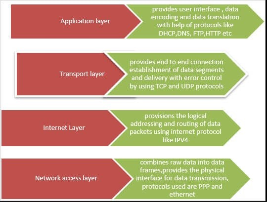
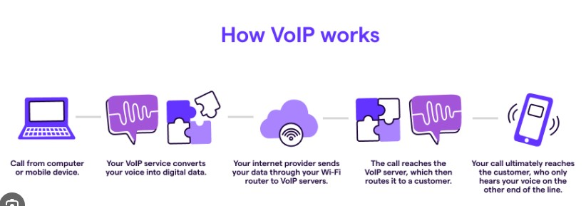

# 3GPP Standards

- Stands for *3rd Generation Partnership Project*
- 3GPP can be defined as a collective term for many standards organizations that develop and maintain protocols for mobile telecommunications for their respective countries
- 3GPP’s main aim is to develop and maintain global technical specifications. It makes sure that network equipment and handset manufacturers can easily develop products interoperable all around the world
- 3GPP standards are designed for mobile systems based on evolved GSM core networks, as well as the radio access technologies they support, service capabilities and security. This includes the maintenance and development of the following:
    - **2G/2.5G** standards, including General Packet Radio Services (GPRS) and Enhanced Data Rates for GSM Evolution (EDGE);
    - **3G** standards, including High Speed Packet Access (HSPA), Universal Terrestrial Radio Access (UTRA) and Japan's Freedom of Mobile Multimedia Access (FOMA);
    - **Long-Term Evolution** wireless broadband technology, LTE Advanced and 4G standards; and
    - **5G** standards.

# Generations of mobile systems

Mobile systems have spanned across five different generations, beginning with the introduction of analog first-generation (1G) technology in the 1980s, up through the deployment of 5G in 2019.

- 1G. These mobile systems began with the introduction of analog cellular service, called the Advanced Mobile Phone Service (AMPS).
- 2G. This generation introduced the first digital systems in the 1990s with voice, Short Message Service (SMS) and data services. The main technologies that power 2G are GSM/GPRS and EDGE, cdmaOne Personal Digital Cellular (PDC), Integrated Digital Enhanced Network (iDEN) and Digital-AMPS (D-AMPS).
- 3G. This generation is based on GSM networks and its supported radio technologies. 3G mobile systems have focused on maintenance and development of GSM networks, GPRS, EDGE, HSPA and UMTS. It includes the original LTE.
- 4G. LTE-Advanced -- the first approved 4G standard -- introduced high-speed data, spectral efficiencies and more advanced radio-to-mobile communications. LTE-Advanced Pro has been developed for use by industries beyond telecom, such as IoT, transportation, education and critical communications.
- 5G. This generation includes technology such as NR and enhancements to the existing LTE-Advanced Pro. 5G standards are specified in Release 15 and beyond.

# OSI Reference Model

- Open System Interconnections (OSI) is a network architecture model based on the ISO standards. It is called the OSI model as it deals with connecting the systems that are open for communication with other systems.
- The OSI model has seven layers. The principles used to arrive at the seven layers can be summarized  briefly as below:
    - Create a new layer if a different abstraction is needed.
    - Each layer should have a well-defined function.
    - The function of each layer is chosen based on internationally standardized protocols

# TCP/IP Reference Model

- It is a compressed version of the OSI model with only 4 layers. It was developed by the US Department of Defence (DoD) in the 1980s. The name of this model is based on 2 standard protocols used i.e. TCP (Transmission Control Protocol) and IP (Internet Protocol).

# Network protocol

- In networking, a protocol is a set of rules for formatting and processing data. Network protocols are like a common language for computers. The computers within a network may use vastly different software and hardware; however, the use of protocols enables them to communicate with each other regardless.
- On the Internet, there are different protocols for different types of processes. Protocols are often discussed in terms of which OSI model layer they belong to.

- Protocols make these networking functions possible. For instance, the Internet Protocol (IP) is responsible for routing data by indicating where data packets* come from and what their destination is. IP makes network-to-network communications possible. Hence, IP is considered a network layer (layer 3) protocol.
- As another example, the Transmission Control Protocol (TCP) ensures that the transportation of packets of data across networks goes smoothly. Therefore, TCP is considered a transport layer (layer 4) protocol.
- A packet is a small segment of data; all data sent over a network is divided into packets.

# Important Protocols

- TCP: As described above, TCP is a transport layer protocol that ensures reliable data delivery. TCP is meant to be used with IP, and the two protocols are often referenced together as TCP/IP.

- HTTP: The Hypertext Transfer Protocol (HTTP) is the foundation of the World Wide Web, the Internet that most users interact with. It is used for transferring data between devices. HTTP belongs to the application layer (layer 7), because it puts data into a format that applications (e.g. a browser) can use directly, without further interpretation. The lower layers of the OSI model are handled by a computer's operating system, not applications.

- HTTPS: The problem with HTTP is that it is not encrypted — any attacker who intercepts an HTTP message can read it. HTTPS (HTTP Secure) corrects this by encrypting HTTP messages.

- TLS/SSL: Transport Layer Security (TLS) is the protocol HTTPS uses for encryption. TLS used to be called Secure Sockets Layer (SSL).

- UDP: The User Datagram Protocol (UDP) is a faster but less reliable alternative to TCP at the transport layer. It is often used in services like video streaming and gaming, where fast data delivery is paramount.

# What Are Routing and Switching?

- The way a network operates is to connect computers and peripherals using two pieces of equipment - switches and routers. These two let the devices connected to your network talk with each other as well as talk to other networks.
- Though they look quite similar, routers and switches perform very different functions in a network:
- Switches are used to connect multiple devices on the same network within a building or campus. For example, a switch can connect your computers, printers and servers, creating a network of shared resources. The switch would serve as a controller, allowing the various devices to share information and talk to each other. Through information sharing and resource allocation, switches save you money and increase productivity.
- There are two basic types of switches: managed and unmanaged.
  - An unmanaged switch works out of the box and does not allow you to make changes. Home-networking equipment often will have unmanaged switches.
  - A managed switch allows you access to program it. This provides greater flexibility because the switch can be monitored and adjusted locally or remotely to give you control on how traffic travels over the network and who has access to your network.
- Routers are used to tie multiple networks together. For example, you would use a router to connect your networked computers to the Internet and thereby share an Internet connection among many users. The router will act as a dispatcher, choosing the best route for your information to travel so that you receive it quickly.
- Routers analyze the data being sent over a network, change how it is packaged and send it to another network or over a different type of network. They connect your business to the outside world, protect your information from security threats, and can even decide which computers get priority over others.
- Depending on your business and your networking plans, you can choose from routers that include different capabilities. These can include functions such as:
    - Firewall: specialized software that examines incoming data and protects your business network against attacks
    - Virtual Private Network (VPN): A way to allow remote employees to safely access your network remotely
    - IP Phone network : Combine your company's computer and telephone network, using voice and conferencing technology, to simplify and unify your communications

# Virtualization

- Virtualization is the "creation of a virtual (rather than actual) version of something, such as a server, a desktop, a storage device, an operating system or network resources".
- Mainly Virtualization means, running multiple operating systems on a single machine but sharing all the hardware resources. And it helps us to provide the pool of IT resources so that we can share these IT resources in order get benefits in the business.

## Types of Virtualization

### Hardware Virtualization:
- When the virtual machine software or virtual machine manager (VMM) is directly installed on the hardware system is known as hardware virtualization.
- The main job of hypervisor is to control and monitoring the processor, memory and other hardware resources.
- After virtualization of hardware system we can install different operating system on it and run different applications on those OS.
- Usage: Hardware virtualization is mainly done for the server platforms, because controlling virtual machines is much easier than controlling a physical server.

### Operating System Virtualization:
- When the virtual machine software or virtual machine manager (VMM) is installed on the Host operating system instead of directly on the hardware system is known as operating system virtualization.
- Usage: Operating System Virtualization is mainly used for testing the applications on different platforms of OS.

### Server Virtualization:
- When the virtual machine software or virtual machine manager (VMM) is directly installed on the Server system is known as server virtualization.
- Usage: Server virtualization is done because a single physical server can be divided into multiple servers on the demand basis and for balancing the load.

### Storage Virtualization:
- Storage virtualization is the process of grouping the physical storage from multiple network storage devices so that it looks like a single storage device.
- Storage virtualization is also implemented by using software applications.
- Usage: Storage virtualization is mainly done for back-up and recovery purposes.

## How does virtualization work in cloud computing?

- The main usage of Virtualization Technology is to provide the applications with the standard versions to their cloud users, suppose if the next version of that application is released, then cloud provider has to provide the latest version to their cloud users and practically it is possible because it is more expensive.

- To overcome this problem we use basically virtualization technology, By using virtualization, all severs and the software application which are required by other cloud providers are maintained by the third party people, and the cloud providers has to pay the money on monthly or annual basis.

# VoIP

- VoIP is a phrase which stands for voice over internet protocol. Simply put, VoIP is a cost-effective way for you to manage an unlimited number of calls to your business phone number without the need of a local phone service
- Here is how a VoIP call works in a few short steps:
  - A caller dials a number and the call is passed from the device to a router.
  - The router passes the voice call to the internet where it reaches a VoIP phone service server.
  - Then the call is transmitted via local internet to the other end of the recipient’s router.
  - Finally the call is then connected to the recipient’s IP device.

# DNS
- The Domain Name System (DNS) is the phonebook of the Internet. 
- Humans access information online through domain names, like nytimes.com or espn.com. Web browsers interact through Internet Protocol (IP) addresses. 
- DNS translates domain names to IP addresses so browsers can load Internet resources.

## How does DNS work?
- The process of DNS resolution involves converting a hostname (such as www.example.com) into a computer-friendly IP address (such as 192.168.1.1). 
- An IP address is given to each device on the Internet, and that address is necessary to find the appropriate Internet device - like a street address is used to find a particular home. When a user wants to load a webpage, a translation must occur between what a user types into their web browser (example.com) and the machine-friendly address necessary to locate the example.com webpage.
- In order to understand the process behind the DNS resolution, it’s important to learn about the different hardware components a DNS query must pass between. For the web browser, the DNS lookup occurs "behind the scenes" and requires no interaction from the user’s computer apart from the initial request.