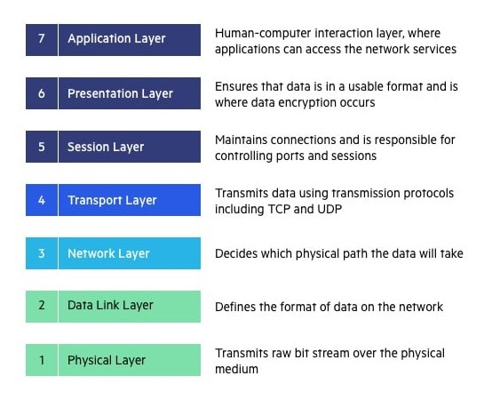

# 3GPP Standards

- Stands for *3rd Generation Partnership Project*
- 3GPP can be defined as a collective term for many standards organizations that develop and maintain protocols for mobile telecommunications for their respective countries
- 3GPP’s main aim is to develop and maintain global technical specifications. It makes sure that network equipment and handset manufacturers can easily develop products interoperable all around the world
- 3GPP standards are designed for mobile systems based on evolved GSM core networks, as well as the radio access technologies they support, service capabilities and security. This includes the maintenance and development of the following:
    - **2G/2.5G** standards, including General Packet Radio Services (GPRS) and Enhanced Data Rates for GSM Evolution (EDGE);
    - **3G** standards, including High Speed Packet Access (HSPA), Universal Terrestrial Radio Access (UTRA) and Japan's Freedom of Mobile Multimedia Access (FOMA);
    - **Long-Term Evolution** wireless broadband technology, LTE Advanced and 4G standards; and
    - **5G** standards.

# Generations of mobile systems

Mobile systems have spanned across five different generations, beginning with the introduction of analog first-generation (1G) technology in the 1980s, up through the deployment of 5G in 2019.

- 1G. These mobile systems began with the introduction of analog cellular service, called the Advanced Mobile Phone Service (AMPS).
- 2G. This generation introduced the first digital systems in the 1990s with voice, Short Message Service (SMS) and data services. The main technologies that power 2G are GSM/GPRS and EDGE, cdmaOne Personal Digital Cellular (PDC), Integrated Digital Enhanced Network (iDEN) and Digital-AMPS (D-AMPS).
- 3G. This generation is based on GSM networks and its supported radio technologies. 3G mobile systems have focused on maintenance and development of GSM networks, GPRS, EDGE, HSPA and UMTS. It includes the original LTE.
- 4G. LTE-Advanced -- the first approved 4G standard -- introduced high-speed data, spectral efficiencies and more advanced radio-to-mobile communications. LTE-Advanced Pro has been developed for use by industries beyond telecom, such as IoT, transportation, education and critical communications.
- 5G. This generation includes technology such as NR and enhancements to the existing LTE-Advanced Pro. 5G standards are specified in Release 15 and beyond.

# OSI Reference Model

- Open System Interconnections (OSI) is a network architecture model based on the ISO standards. It is called the OSI model as it deals with connecting the systems that are open for communication with other systems.
- The OSI model has seven layers. The principles used to arrive at the seven layers can be summarized  briefly as below:
    - Create a new layer if a different abstraction is needed.
    - Each layer should have a well-defined function.
    - The function of each layer is chosen based on internationally standardized protocols

